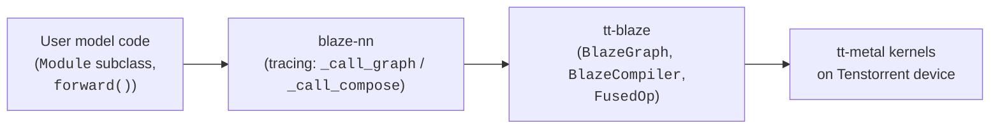

# What blaze-nn is (and is not)

## One-paragraph answer

blaze-nn is a **PyTorch-style API that traces `forward()` into a tt-blaze graph for Tenstorrent hardware**. You write a `Module` subclass the same way you would for `torch.nn.Module` — declare `Parameter` attributes in `__init__`, override `forward()`, call functional ops — and on first call the framework records the ops, hands the resulting graph to tt-blaze's compiler, and runs the compiled program on a Tenstorrent device. The author surface is PyTorch-shaped; the runtime is dataflow, not eager.

## The framework in its own words

The package docstring at `blaze_nn/__init__.py:1-7`:

> blaze_nn: PyTorch-style neural network interface for Tenstorrent hardware. The framework is ttnn-native: parameters, inputs, and outputs are `ttnn.Tensor`. No torch tensors flow through the framework code; users that want torch interop convert at their own boundary (see `blaze_nn.interop` for thin helpers).

The README (`README.md:3-12`) names five selling points — **PyTorch-style API**, **ttnn-native**, **automatic tracing**, **universal op dispatch**, **single-op modules without subclassing** — which the rest of this guide unpacks. The three load-bearing words are **PyTorch-style**, **ttnn-native**, and **tracing**.

## Three-way picture: where each layer lives

- **User model code** uses only the public surface: `Module`, `Parameter`, the containers, `OpModule`, the pre-built `Linear` / `RMSNorm`, and `F.<op>` in `forward()`.
- **blaze-nn** owns the trace: it intercepts `model(x)`, records ops via the functional dispatcher, and produces a `BlazeGraph` plus a port-name → `ttnn.Tensor` binding dict (see `blaze_nn/modules/base.py:91-106`).
- **tt-blaze** owns compilation and fusion: `BlazeCompiler(dc.device).compile(graph, tensors, output_tensor, user_args)` (see `blaze_nn/modules/base.py:115-121`) turns the recorded graph into a runnable `program`.
- **tt-metal kernels** are what actually executes on the device when `program.run()` is called (see `blaze_nn/modules/base.py:122`).

> **For contributors:** the line-by-line walk of `_call_graph` lives in Chapter 5 (`module_call_path.md`).

## What blaze-nn is **not**

- **Not an autograd engine.** `Parameter` has no `requires_grad`, no grad buffer; see `blaze_nn/parameter.py:16-26`. Training is not in scope.
- **Not a kernel library.** Kernels live in tt-metal; tt-blaze composes them; blaze-nn only records *which* ops to call in *what* order. No CUDA-equivalent custom kernel work happens here.
- **Not a torch-compatible tensor type.** There is no `BlazeTensor`, no `as_blaze(t)`. Tensors flowing through a `Module` are `ttnn.Tensor` and only `ttnn.Tensor`. The full reasoning is in [The ttnn-native contract](ttnn_native_contract.md).
- **No eager execution.** Calling `model(x)` does not execute ops one-by-one. The first call opens a tracing context (`blaze_nn/modules/base.py:91`), runs `forward()` to *record* the graph, then compiles and runs it. Inside the `forward()` body, `F.matmul(...)` returns a `TensorProxy`, not a `ttnn.Tensor`.
- **No implicit device placement.** `module.to(device)` records a `DeviceConfig`; it does **not** move parameters, change layout, or promote dtypes. The user constructs `ttnn.Tensor`s with the desired `memory_config` / `shard_spec` *before* `load_state_dict`. (Restated as a `> **Warning:**` in Chapter 2's `device_binding.md`.)

## blaze-nn vs. tt-blaze vs. ttnn: three names

These names get swapped in conversation; the guide keeps them distinct:

| layer | distribution name | python import | author-facing primitives |
|---|---|---|---|
| this framework | **blaze-nn** | `blaze_nn` | `Module`, `Parameter`, `Sequential`, `F.<op>` |
| upstream compiler | **tt-blaze** | `blaze` | `blaze.fuse()`, `FusedProgram`, `BlazeOp`, `BlazeCompiler` |
| tensor library | **ttnn** | `ttnn` | `ttnn.Tensor`, `MemoryConfig`, `ShardSpec` |

A model author works exclusively with the **blaze-nn** column. The **tt-blaze** column is the runtime that blaze-nn drives, and is consumed via `F.<op>` rather than direct calls in user code. The **ttnn** column is the only tensor type that ever crosses a `Module` boundary.

> **For contributors:** the `F.<op>` → tt-blaze op resolution path — including the lazy `__getattr__` that lets *any* op registered in `BlazeOp._class_registry` become `F.<op>(...)` with no per-op wiring in blaze-nn — is walked in Chapter 6 `functional_dispatch.md`. You do not need that machinery to write a model; you do need it to add an op.

_Next: [The ttnn-native contract](ttnn_native_contract.md) · [Up](index.md)_
