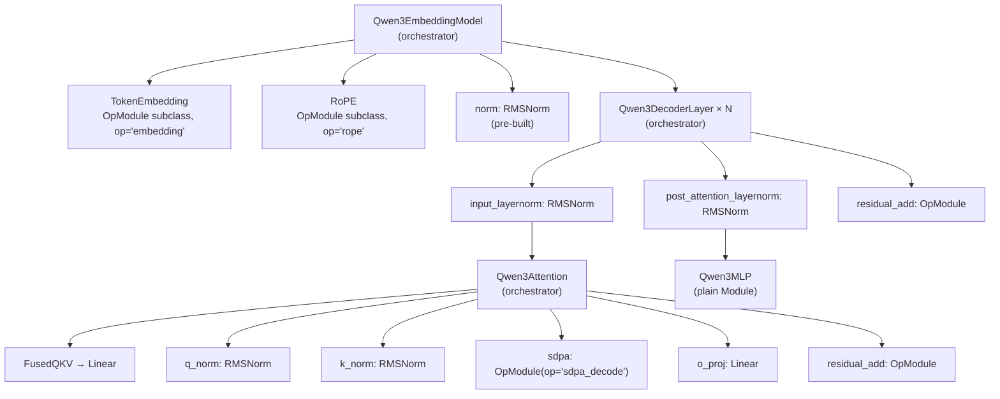

# Composing submodules

With the three lifetimes in hand, we can read the qwen3 submodules straight through. Each one is one of three shapes from Chapter 3 — plain `Module`, `OpModule(op=..., params=...)` (no subclass), or an `OpModule` subclass — plus a pre-built `Linear` or `RMSNorm`. This section catalogs every submodule, names which Chapter 3 shape it uses, and points out the one or two non-obvious lines.



## `TokenEmbedding` — `OpModule` subclass with a custom `forward`

`examples/qwen3_embedding_0_6b/modules/token_embedding.py:10-33`. Class-level `op = "embedding"` and `params = ("weight",)`. The custom `forward` reads `self._parameters["weight"]._tensor.buffer_address()` and injects it as `weight_buffer_address` so the embedding op consumes the weight by DRAM read rather than as a graph input (`token_embedding.py:25`). `dim * 2` is the row stride in bytes for bf16. The `merged.update(self._op_kwargs); merged.update(kwargs)` pattern at `token_embedding.py:31-32` is the standard `OpModule`-subclass kwarg precedence: construction kwargs first, call kwargs override.

## `FusedQKV` — plain `Module` wrapping a pre-built `Linear`

`examples/qwen3_embedding_0_6b/modules/qkv_proj.py:11-57`. The whole point of `FusedQKV` is to (a) own the user-args attached to the QKV projection (`_ua_blackhole_cores = "64x8"` at `qkv_proj.py:29`) and (b) remap the state-dict key `weight` → `linear.weight` on load. The class has no Parameters of its own; it forwards to `self.linear` (which *is* a `blaze_nn.Linear`):

```python
def __init__(self, cfg):
    super().__init__()
    self.cfg = cfg
    self.linear = Linear(cfg.dim, cfg.qkv_out_dim)
    self._ua_blackhole_cores = "64x8"

def load_state_dict(self, state_dict):
    remapped = {}
    for key, value in state_dict.items():
        if key == "weight":
            remapped["linear.weight"] = value
        else:
            remapped[key] = value
    super().load_state_dict(remapped)

def forward(self, hidden_states, **kwargs):
    return self.linear(hidden_states, **kwargs)
```

Three things to notice:

- **`_ua_*` lives on the outer Module.** `FusedQKV` overrides `_collect_user_args` (`qkv_proj.py:40-45`) to harvest every `_ua_*` attribute on itself. This means the `BlazeCompiler.compile(..., user_args=...)` call uses `FusedQKV`'s view, not `Linear`'s. That distinction matters because `FusedQKV` is the *graph boundary* — it's the Module the outer code calls — so its `_collect_user_args` is the one that runs.
- **Caller-allocated output is delegated.** `Linear` requires `set_output_tensor` before forward. `FusedQKV.set_output_tensor` (`qkv_proj.py:31-32`) and `_get_output_tensor` (`qkv_proj.py:34-38`) forward the call to the inner `self.linear`.
- **The key remap.** From outside, the state-dict key is just `weight`; inside the module tree it becomes `linear.weight`. The weight loader emits `qkv.weight`; `Qwen3Attention.load_state_dict` does the second remap on `o_proj_weight → o_proj.weight` for the same reason.

## `Qwen3MLP` — plain `Module` with three Parameters

`examples/qwen3_embedding_0_6b/modules/mlp.py:12-31`. Three Parameters, no child modules. The `forward` is a manual three-step `F.matmul` chain:

```python
def forward(self, hidden_states, **kwargs):
    gate = F.matmul(hidden_states, self.gate_proj_weight)
    up   = F.matmul(hidden_states, self.up_proj_weight)
    activated = F.gated_reduce(gate, up, activation="silu")
    return F.matmul(activated, self.down_proj_weight)
```

Each `F.matmul(...)` call produces a `TensorProxy` (in graph mode) and `F.gated_reduce` consumes the two proxies and produces one. Inside an active tracing context — which `Module.__call__` opens on entry to `Qwen3MLP.forward` — all of this is graph building, not execution. After `forward` returns, the context exits, the graph is compiled by `BlazeCompiler`, and `program.run()` runs the entire MLP as one fused program. `Qwen3MLP` is therefore the smallest example in the port of "non-orchestrator: open a context, build a graph, compile, run."

`Qwen3MLP` also overrides `_collect_user_args` (`mlp.py:20-25`) so that any future `_ua_*` knob (e.g. `_ua_fp32_dest_acc_en`) attached to the MLP makes it into the compiler.

## `RoPE` — `OpModule` subclass with three Parameters

`examples/qwen3_embedding_0_6b/modules/rope.py:9-61`. Class-level `op = "rope"` and `params = ("cos", "sin", "trans_mat")`. The Parameter routing demonstrates the lifetimes story end-to-end:

- `trans_mat` flows as a real graph input: it appears in `F.rope(x, trans_mat, ...)` at `rope.py:61`.
- `cos` and `sin` are read as buffer addresses inside `forward` and passed as kwargs `cos_tensor_address` and `sin_tensor_address`.
- `position_ids` is a Buffer — declared `self.position_ids: Any = None` in `__init__` (`rope.py:30`), bound by `set_position_ids(position_ids_tensor)` (`rope.py:32-33`), and its address is passed as `position_ids_tensor_address`.

`RoPE` does not override `__call__`; it is a leaf `OpModule` and the default tracing path applies. The reason RoPE has a custom `forward` at all is precisely to do the buffer-address dereferences before invoking `F.rope`.

## Norms — `blaze_nn.ops.RMSNorm`

Three of the four norms in the model are the pre-built `RMSNorm` from `blaze_nn/ops/rmsnorm/op.py`: `input_layernorm` and `post_attention_layernorm` on each decoder layer (`modules/decoder_layer.py:26,28`), and the final `norm` (`modules/model.py:64`). They are instantiated with `RMSNorm(cfg.dim, eps=cfg.norm_eps)`.

The other two — `q_norm` and `k_norm` inside `Qwen3Attention` (`modules/attention.py:46-47`) — are also `RMSNorm` instances but with `head_dim` not `dim`, because they normalize per-head. They sit between `nlp_create_qkv_heads_decode` and `RoPE` in the attention pipeline.

## `Qwen3Attention` — orchestrator with host hops

`examples/qwen3_embedding_0_6b/modules/attention.py:27-165`. `Qwen3Attention` is a plain `Module` that orchestrates eight pieces:

- `self.qkv = FusedQKV(cfg)` — the QKV projection.
- `self.q_norm`, `self.k_norm` — per-head `RMSNorm`s.
- `self.sdpa = OpModule(op="sdpa_decode")` — the no-subclass form (`attention.py:48`); SDPA decode is exposed by tt-blaze and the default `OpModule.forward` does the right thing.
- `self.o_proj = Linear(cfg.q_out_dim, cfg.dim)` with `_ua_blackhole_cores = "32x8"` (`attention.py:49-50`).
- `self.residual_add = OpModule(op="residual_add")` (`attention.py:51`).
- `self.k_cache`, `self.v_cache`, `self.attn_out_tensor`, `self.o_proj_out_tensor`, `self.qkv_out_tensor` — Buffers (all `None` until init_*).

The `forward` (`attention.py:130-165`) is plain Python, not a graph — see [orchestrator_pattern.md](orchestrator_pattern.md). It mixes:

1. **Graph-building sub-module calls.** `self.qkv(hidden_states)`, `self.q_norm(q_heads)`, `self.rope(q_normed)`, `self.sdpa(...)`, `self.o_proj(attn)`, `self.residual_add(residual, o)` — each opens a tracing context, compiles, and runs.
2. **Direct ttnn host hops.** `ttnn.experimental.nlp_create_qkv_heads_decode(qkv, ...)` (`attention.py:145-149`), `ttnn.kv_cache.update_cache_for_token_(...)` (`attention.py:159-160`), and the two private bridges `_bridge_kv_for_cache_update` and `_bridge_q_for_sdpa` (`attention.py:93-128`) that do `sharded_to_interleaved → slice → permute/interleaved_to_sharded`.

The bridges exist because the op shape contracts disagree: `nlp_create_qkv_heads_decode` emits k/v as HEIGHT_SHARDED `(1, 32, n_kv, head_dim)` but `update_cache_for_token_` expects INTERLEAVED `(1, n_kv, 1, head_dim)`. They are detailed in [buffers_and_address_baking.md](buffers_and_address_baking.md).

## `Qwen3DecoderLayer` — the four-piece orchestrator

`examples/qwen3_embedding_0_6b/modules/decoder_layer.py:14-53`. The layer holds `input_layernorm` (RMSNorm), `self_attn` (Qwen3Attention), `post_attention_layernorm` (RMSNorm), `mlp` (Qwen3MLP), and a `residual_add = OpModule(op="residual_add")`. Its `forward` (`decoder_layer.py:35-53`) is the textbook decoder-layer skeleton:

```python
def forward(self, hidden_states, *, cur_pos, cur_pos_tensor, **kwargs):
    normed = self.input_layernorm(hidden_states)
    post_attn = self.self_attn(
        normed,
        cur_pos=cur_pos,
        cur_pos_tensor=cur_pos_tensor,
        residual=hidden_states,
    )
    normed2 = self.post_attention_layernorm(post_attn)
    mlp_out = self.mlp(normed2)
    return self.residual_add(post_attn, mlp_out)
```

Note that the first residual add happens *inside* `Qwen3Attention.forward` (via `self.residual_add(residual, o)` at `attention.py:165`), so this layer's own `residual_add` is the MLP residual. That detail is easy to miss; it matches the standard "Qwen3 decoder = attn-with-residual then mlp-with-residual" topology.

## `Qwen3EmbeddingModel` — the top-level orchestrator

`examples/qwen3_embedding_0_6b/modules/model.py:55-322`. The model holds:

- `embed_tokens: TokenEmbedding(cfg.vocab_size, cfg.dim)` (`model.py:59`).
- `rope: RoPE(cfg.head_dim)` (`model.py:60`).
- `layers: ModuleList([Qwen3DecoderLayer(cfg, i) for i in range(cfg.effective_n_layers)])` (`model.py:61-63`).
- `norm: RMSNorm(cfg.dim, eps=cfg.norm_eps)` (`model.py:64`).
- `position_ids: Any = None` — a Buffer (`model.py:65`).

`bind_rope()` (`model.py:74-76`) walks the layers and calls `layer.self_attn.set_rope(self.rope)` so every attention block shares the same `RoPE` instance — important because `RoPE.position_ids` is the same Buffer reference. The `forward` (`model.py:307-322`) is a six-line loop:

```python
h = self.embed_tokens(input_ids)
for layer in self.layers:
    h = layer(h, cur_pos=cur_pos, cur_pos_tensor=cur_pos_tensor)
return self.norm(h)
```

Each `layer(h, ...)` is a separate orchestrator call. `self.embed_tokens(...)` and `self.norm(h)` each open a tracing context and compile (the first call) or run a cached program (after the first call) — see Ch5 for the cache mechanics.

## The full submodule inventory

For one Qwen3 decoder layer, this is the complete inventory:

| qwen3 class                  | Ch3 primitive               | Parameters                                | Notes                                  |
| ---------------------------- | --------------------------- | ----------------------------------------- | -------------------------------------- |
| `TokenEmbedding`             | `OpModule` subclass         | `weight` (address)                        | Model-level, used once                 |
| `FusedQKV`                   | `Module` wrapping `Linear`  | `weight` (via `linear.weight`)            | State-dict remap; `_ua_blackhole_cores`|
| `RMSNorm` (q_norm/k_norm)    | `blaze_nn.ops.RMSNorm`      | `gamma` (graph input)                     | Pre-built, unmodified                  |
| `OpModule(op="sdpa_decode")` | `OpModule` no-subclass      | none                                      | Output set via `set_output_tensor`     |
| `Linear` (o_proj)            | `blaze_nn.Linear`           | `weight` (graph input)                    | `_ua_blackhole_cores = "32x8"`         |
| `OpModule(op="residual_add")`| `OpModule` no-subclass      | none                                      | Trivial wrapper                        |
| `Qwen3MLP`                   | plain `Module`              | 3 weights (graph inputs)                  | Hand-rolled `F.*` chain                |
| `RoPE`                       | `OpModule` subclass         | `cos` / `sin` (addr), `trans_mat` (input) | Plus `position_ids` Buffer             |

The orchestrators (`Qwen3Attention`, `Qwen3DecoderLayer`, `Qwen3EmbeddingModel`) wire these together. Their structure is the subject of the next file.

> **For contributors:** the dispatch step `F.<op>` performs to reach the actual blaze op handle is in Ch6 `functional_dispatch.md`; the alias registry that lets `linear → matmul` work is in Ch6 `registry.md`.

_Previous: [Tensor lifetimes: Parameter / Buffer / GraphInput](tensor_lifetimes.md) · Next: [The orchestrator pattern: two mechanisms](orchestrator_pattern.md) · [Up](index.md)_
