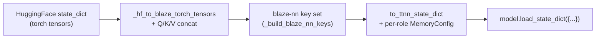

# Layout and the weight loader

`examples/qwen3_embedding_0_6b/` is the one end-to-end model in the repo and the canonical reference for how a real port wires the public API together. The directory has five entry points:

```
examples/qwen3_embedding_0_6b/
  __init__.py        # re-exports Qwen3EmbeddingConfig and Qwen3EmbeddingModel
  config.py          # frozen dataclass; derived shape properties
  weight_loader.py   # HF → torch → ttnn pipeline; the only torch boundary
  modules/           # the model itself; no torch in forward()
    __init__.py            # the lifetimes contract (see tensor_lifetimes.md)
    token_embedding.py
    qkv_proj.py
    mlp.py
    rope.py
    attention.py
    decoder_layer.py
    model.py
    _blaze_nn_linear_patch.py
  tests/             # L0 / L1 / layer / e2e parity tests
  demo/encode.py     # placeholder; Phase B
```

The boundary worth memorising: **torch appears in `weight_loader.py` and in setup helpers (`init_*` methods on `Qwen3EmbeddingModel`). Inside `modules/*.py`, torch never appears in `forward()`.** Every `forward` only touches `ttnn.Tensor`, `F.<op>(...)`, and (where the lifetime contract permits) `int(t.buffer_address())`.

Two files set the stage; the rest of the chapter assumes them. We tour them now.

## `config.py` — the frozen shape contract

`Qwen3EmbeddingConfig` is a `@dataclass(frozen=True)` (see `examples/qwen3_embedding_0_6b/config.py:6-19`) holding the model's structural integers — `vocab_size=151936`, `dim=1024`, `n_layers=28`, `n_heads=16`, `n_kv_heads=8`, `head_dim=128`, `intermediate_size=3072`, `max_seq_len=512`, `norm_eps=1e-6`, `rope_theta=1e6`. Plus one knob for tests: `n_layers_override` lets a test build a 1- or 2-layer model.

The derived properties matter more than the raw fields, because every module reads from them:

- `effective_n_layers` — respects the override (`config.py:22`).
- `n_kv_groups = n_heads // n_kv_heads` — for grouped-query attention (`config.py:26`).
- `qkv_out_dim = (n_heads + 2*n_kv_heads) * head_dim` — the fused QKV output width (`config.py:30`); this is what `FusedQKV` projects to.
- `q_out_dim` and `kv_out_dim` — used by the weight loader when concatenating `q‖k‖v`.

The `frozen=True` is load-bearing: configs are passed by value down the module tree, and a stray mutation would invalidate the shape assumptions every downstream `Parameter()` and memory config depends on.

> **Note:** The config is frozen on purpose. Once a `Qwen3EmbeddingModel` is constructed, *nothing* mutates the config — buffer shapes and memory configs derive from it deterministically, so test fixtures can hash a config to key cached state.

## `weight_loader.py` — the HF → ttnn bridge

The weight loader is the **only** place torch appears in this example outside `__init__` helpers. Inside `modules/`, torch never touches a `forward()`. This is the explicit boundary `interop_at_the_boundary.md` (Ch2) calls out: model authors push torch as far from the hot path as possible. The loader is a four-stage pipeline.

**Stage 1 — fetch HF weights.** `_load_hf_state_dict(model_id)` (`weight_loader.py:72-78`) loads `AutoModel.from_pretrained(...)` and clones the state dict; for offline tests `_dummy_state_dict(cfg)` (`weight_loader.py:32-69`) builds a random-initialized analogue with identical keys.

**Stage 2 — key remap and Q/K/V fuse.** `_hf_to_blaze_torch_tensors(hf_sd, cfg)` (`weight_loader.py:105-152`) rewrites HF's keys to the blaze-nn key set. The single non-trivial transform is fusing `q_proj` / `k_proj` / `v_proj` into one matrix:

```python
wq = hf_sd[f"{hf_prefix}.self_attn.q_proj.weight"].to(torch.bfloat16)
wk = hf_sd[f"{hf_prefix}.self_attn.k_proj.weight"].to(torch.bfloat16)
wv = hf_sd[f"{hf_prefix}.self_attn.v_proj.weight"].to(torch.bfloat16)
wqkv = torch.cat([wq, wk, wv], dim=0)
out[f"{blaze_prefix}.self_attn.qkv.weight"] = wqkv
```

This is row-axis concatenation; the resulting matrix has `qkv_out_dim` rows. `FusedQKV` then exposes this as a single `weight` slot via its `load_state_dict` remap (see [composing_submodules.md](composing_submodules.md)). This is **the** structural difference between the HF model and the blaze-nn port; nothing else changes shape.

The RoPE tables (`cos`, `sin`, `trans_mat`) are also pre-computed here via `_precompute_rope_tables` (`weight_loader.py:8-29`) — they are model constants, not training weights, but they flow through the same `state_dict` channel so `load_state_dict` populates them automatically.

**Stage 3 — declare the expected key set.** `_build_blaze_nn_keys(cfg)` (`weight_loader.py:81-102`) returns the exact list of dotted paths blaze-nn will accept, and `expected_state_dict_keys(cfg)` exposes it publicly. Per layer:

```
layers.{i}.input_layernorm.gamma
layers.{i}.self_attn.qkv.weight
layers.{i}.self_attn.q_norm.gamma
layers.{i}.self_attn.k_norm.gamma
layers.{i}.self_attn.o_proj_weight
layers.{i}.post_attention_layernorm.gamma
layers.{i}.mlp.gate_proj_weight
layers.{i}.mlp.up_proj_weight
layers.{i}.mlp.down_proj_weight
```

Plus the three RoPE keys, `embed_tokens.weight`, and `norm.gamma`. Note the bare-key naming for `o_proj_weight` and the MLP weights: those modules hold a plain `Parameter()` named `o_proj_weight` directly rather than a child `Linear` named `o_proj` — that choice is what `Qwen3MLP` and `Qwen3Attention` reflect on load.

> **Note:** The L0 keys test (`tests/test_l0_keys.py`) asserts `Qwen3EmbeddingModel.state_dict().keys() == expected_state_dict_keys(cfg)`. If the model gains or loses a parameter, that test catches it before any device-bound test runs.

**Stage 4 — torch → ttnn with per-role memory configs.** `to_ttnn_state_dict(torch_sd, mesh_device, ...)` (`weight_loader.py:216-322`) walks the key set and chooses a `ttnn.MemoryConfig` per role. This is where the layout reality lives.

The role table is `_ROLE_TO_CORES = {"qkv": 64, "o_proj": 32, "mlp": 32}` (`weight_loader.py:168`). The helper `_wsharded_linear_weight_mc(in_features, out_features, role)` (`weight_loader.py:188-213`) picks an 8x8 sub-grid for qkv and a 4x8 sub-grid for o_proj / mlp, then builds a WIDTH_SHARDED L1 memory config — but only if the shape divides cleanly. The fallback is explicit:

```python
n_cores = cores_x * cores_y
if out_features % n_cores != 0:
    return ttnn.DRAM_MEMORY_CONFIG
shard_w = out_features // n_cores
if in_features % 32 != 0 or shard_w % 32 != 0:
    return ttnn.DRAM_MEMORY_CONFIG
```

If the math doesn't work, fall back to `DRAM_MEMORY_CONFIG` and let the kernel handle it. The norm `gamma` tensors get their own helper, `_gamma_mc_for_width(width)` (`weight_loader.py:171-185`), which is HEIGHT_SHARDED on a single core at `(0, 0)` — this matches the per-core CB page size the RMSNorm kernel expects.

The full role mapping is:

| key suffix              | role     | layout / memory                                                    |
| ----------------------- | -------- | ------------------------------------------------------------------ |
| `embed_tokens.weight`   | embed    | ROW_MAJOR + DRAM                                                   |
| `.gamma`                | norm     | TILE_LAYOUT + HEIGHT_SHARDED L1 on 1 core, shard `(1, width)`      |
| `rope.trans_mat`        | rope     | TILE_LAYOUT (default mem)                                          |
| `rope.cos` / `rope.sin` | rope     | ROW_MAJOR + DRAM                                                   |
| `.qkv.weight`           | qkv      | TILE_LAYOUT + WIDTH_SHARDED L1 on `8x8` grid (64 cores)            |
| `.o_proj_weight`        | o_proj   | TILE_LAYOUT + WIDTH_SHARDED L1 on `4x8` grid (32 cores)            |
| `.gate/up/down_*`       | mlp      | TILE_LAYOUT + WIDTH_SHARDED L1 on `4x8` grid (32 cores)            |

Each of these layout choices is what the corresponding op's kernel reads — model authors do not get to pick freely; the kernel's contract is the constraint.



> **Warning:** `load_state_dict` does no dtype coercion, no layout conversion, and no device move (Ch2 `traversal_and_state_dict.md`). Whatever `ttnn.Tensor` `to_ttnn_state_dict` produces is the one the model uses verbatim. Pass `mesh_device=device` once at construction; do not try to re-shard after load.

## What this means for the rest of the chapter

Three takeaways carry forward:

1. **Torch boundary is one file.** Everything in `modules/` consumes only `ttnn.Tensor`. The lifetime story in the next section assumes torch never appears in `forward()`.
2. **`load_state_dict` is the only inbound channel for frozen weights.** Anything not in the key set is *not* a Parameter — that delineates Parameters from Buffers in the next section.
3. **Memory config is policy, not data.** It is decided at load time by role and shape; the modules' `forward()` methods do not allocate memory configs themselves. The few exceptions (the bridges in `Qwen3Attention`) are flagged explicitly.

> **For contributors:** how `load_state_dict` actually walks the dict and assigns `_tensor` to each `Parameter` was covered in Ch2 `traversal_and_state_dict.md`; how Parameters then become graph-input ports versus baked-in addresses is covered next. The `interop` helpers (`blaze_nn.interop.to_device_tensor`, `to_torch`) from Ch2 are the public version of what `to_ttnn_state_dict` does by hand here — `weight_loader.py` bypasses them only because it needs per-role memory configs that the generic helper doesn't expose. The "no interop inside `blaze_nn/`" rule is recapped in Ch7 `contributing_checklist.md`.

_Previous: [Chapter 3 — Containers, OpModule, and pre-built ops](../ch3_containers_and_opmodule/prebuilt_modules.md) · Next: [Tensor lifetimes: Parameter / Buffer / GraphInput](tensor_lifetimes.md) · [Up](index.md)_
