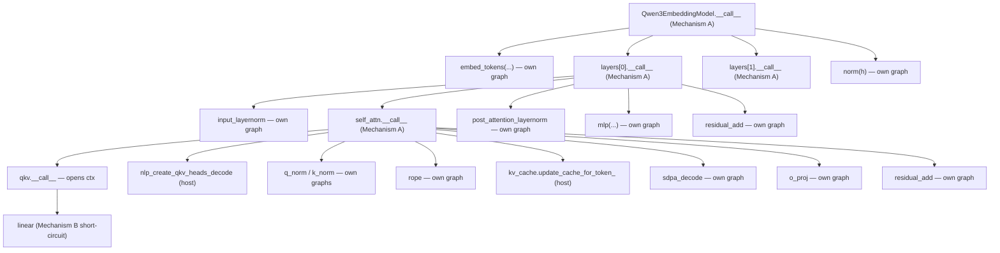

# The orchestrator pattern: two mechanisms

Three of the qwen3 modules — `Qwen3Attention`, `Qwen3DecoderLayer`, and `Qwen3EmbeddingModel` — are **orchestrators**: their `forward()` runs as plain Python at the top level, not as a single compiled graph. They have to, because each contains at least one operation that does not live in a tt-blaze graph (host hops in attention; multiple disjoint compiles in the decoder layer and the model).

The mechanism that makes this work is the most often-misread part of the framework. There are actually **two** separate mechanisms, and orchestrators need only one of them. The other governs every non-orchestrator nested call. We name both, show which applies where, and walk the qwen3 tree end-to-end.

- **Mechanism A — orchestrator `__call__` override.** The orchestrator class itself bypasses `Module.__call__`'s graph-build pipeline at the top level. Used by all three qwen3 orchestrators.
- **Mechanism B — active-context short-circuit at `blaze_nn/modules/base.py:71`.** The framework's *built-in* re-entry guard, triggered when any `Module.__call__` runs while a tracing context is already open. Fires in qwen3 inside `FusedQKV`.

Both are necessary in a full model; they handle different problems.

## Why orchestrators exist at all

The fundamental constraint: **`ttnn.experimental.nlp_create_qkv_heads_decode`, `ttnn.kv_cache.update_cache_for_token_`, and `ttnn.sharded_to_interleaved` are host-side operations.** They cannot live inside a single tt-blaze graph; the compiler has no nodes for them. So any `forward()` that needs them must be broken into pieces, each piece a graph, with host code stitching the pieces together. `Qwen3Attention.forward` is the canonical case:

```python
# modules/attention.py (forward body, abridged)
qkv = self.qkv(hidden_states)                                                        # graph
q_heads, k_heads, v_heads = ttnn.experimental.nlp_create_qkv_heads_decode(qkv, ...)  # host
q_normed = self.q_norm(q_heads); k_normed = self.k_norm(k_heads)                     # graphs
q_roped = self.rope(q_normed); k_roped = self.rope(k_normed)                         # graphs
k_for_cache = self._bridge_kv_for_cache_update(k_roped)                              # host
ttnn.kv_cache.update_cache_for_token_(self.k_cache, k_for_cache, cur_pos)            # host
q_for_sdpa = self._bridge_q_for_sdpa(q_roped)                                        # host
attn = self.sdpa(q_for_sdpa, self.k_cache, self.v_cache, cur_pos_tensor)             # graph
o = self.o_proj(attn)                                                                # graph
return self.residual_add(residual, o)                                                # graph
```

Eight `ttnn.Tensor`-typed transitions; ~7 graphs compiled the first time; the host hops fill the gaps.

## Mechanism A — orchestrator `__call__` override

`Module.__call__` (in `blaze_nn/modules/base.py:68-82`) is the standard entry point for tracing: it opens a `GraphTracingContext`, wraps the args, runs `forward`, exits, compiles, and returns a real `ttnn.Tensor`. **An orchestrator does not want any of that to happen.** It wants `forward()` to run as ordinary Python so it can interleave graph-building submodule calls with direct ttnn host calls.

If you let `Qwen3Attention.__call__` run the inherited `Module.__call__`, that base implementation would open a `GraphTracingContext` at the top level, then call `forward`. Inside that `forward`, the very first nested `self.qkv(hidden_states)` would hit Mechanism B's short-circuit and bypass *its own* graph build — which is wrong, because we actively want each child to compile its own graph. The whole point is that the orchestrator is **not** a single graph.

The way the qwen3 port opts out is to override `__call__` with a two-liner that bypasses `Module.__call__` entirely. The same two lines appear in three modules:

```python
# Qwen3Attention — modules/attention.py:90-91
def __call__(self, *args: Any, **kwargs: Any) -> Any:
    return self.forward(*args, **kwargs)
```

```python
# Qwen3DecoderLayer — modules/decoder_layer.py:32-33
def __call__(self, *args: Any, **kwargs: Any) -> Any:
    return self.forward(*args, **kwargs)
```

```python
# Qwen3EmbeddingModel — modules/model.py:67-68
def __call__(self, *args: Any, **kwargs: Any) -> Any:
    return self.forward(*args, **kwargs)
```

That's it — a direct passthrough. No tracing context is opened by these modules, no compilation happens *for them*, no `wrap_input` runs on their arguments. When the outer code writes `model(input_ids, cur_pos=cur_pos, cur_pos_tensor=cur_pos_tensor)`, control goes straight into `Qwen3EmbeddingModel.forward`, which loops over the layers in plain Python:

```python
h = self.embed_tokens(input_ids)
for layer in self.layers:
    h = layer(h, cur_pos=cur_pos, cur_pos_tensor=cur_pos_tensor)
return self.norm(h)
```

`self.embed_tokens(...)` is a `TokenEmbedding` call — that *does* hit `Module.__call__`, opens its own `GraphTracingContext`, compiles, and returns a real `ttnn.Tensor`. `layer(h, ...)` is a `Qwen3DecoderLayer` call — that hits the override above, which calls `forward` as plain Python. `self.norm(h)` is an `RMSNorm` call — `Module.__call__` again.

The same pattern nests: inside `Qwen3DecoderLayer.forward`, `self.input_layernorm(h)` is a graph-mode call (Module.__call__) and `self.self_attn(...)` is a plain-Python call (Qwen3Attention's override). Inside `Qwen3Attention.forward`, `self.qkv(hidden_states)` and `self.q_norm(q_heads)` are graph-mode calls, and the `ttnn.experimental.nlp_create_qkv_heads_decode(...)` between them is a direct host call.

> **Warning:** Forgetting the `__call__` override is one of the most subtle errors when porting a new model. The first run will *seem* to work — the inner modules' `forward()` will execute — but their `F.*` calls will scribble onto the orchestrator's context, the resulting graph will be malformed (it will contain ops that should have been their own graphs), and PCC will collapse on the first multi-host-hop layer. Always carry the override.

## When you need Mechanism A

Three signals tell you a module needs the orchestrator override:

1. **`forward` contains direct `ttnn.*` calls or host-side Python control flow that can't be expressed inside a single tt-blaze graph.** Examples in qwen3: `ttnn.experimental.nlp_create_qkv_heads_decode`, `ttnn.kv_cache.update_cache_for_token_`, `ttnn.sharded_to_interleaved`, `ttnn.slice`, `ttnn.permute`, `ttnn.interleaved_to_sharded`.
2. **`forward` is a Python loop over child Modules,** each of which is itself a separate compile. The model's `for layer in self.layers` loop is the canonical case; without the override, `Module.__call__` would open one tracing context for the whole loop, every nested compile would still try to open another, and the active-context state would be ambiguous.
3. **`forward` does conditional control flow based on Python-level values** (e.g. `if not self._rope_bound: raise ...` at `modules/attention.py:141-142`). Branching on Python values inside a tracing context doesn't lift cleanly to the graph; doing it at the orchestrator level keeps Python and graph layers cleanly separated.

If none of these apply, you do **not** want Mechanism A — leave `__call__` alone and let the framework trace `forward` as one graph. `Qwen3MLP` is the cleanest counter-example: its three `F.matmul` calls plus a `F.gated_reduce` compile into a single graph. It deliberately does not override `__call__`.

## Mechanism B — active-context short-circuit at `base.py:71`

The second mechanism handles a different scenario: a `Module` being called from inside an already-open tracing context. Look at `Module.__call__`:

```python
# blaze_nn/modules/base.py:68-82
def __call__(self, *args: Any, **kwargs: Any) -> Any:
    from .._tracing import _get_active_context

    if _get_active_context() is not None:
        return self.forward(*args, **kwargs)

    is_compose = getattr(
        getattr(type(self), "forward", None),
        "_blaze_nn_compose",
        False,
    )

    if is_compose:
        return self._call_compose(*args, **kwargs)
    return self._call_graph(*args, **kwargs)
```

The first three lines (`base.py:69-72`) are Mechanism B. If a tracing context is already active, `__call__` short-circuits straight to `forward` — no new context, no second compile. This is the framework's way of saying: "you are already inside someone else's graph; do not start your own." Two nested `Module` calls fuse into one graph.

## How the two mechanisms interact in qwen3

Stack them up — caller × callee, with which mechanism fires at each boundary:

| Caller | Callee | What runs |
|---|---|---|
| Python `model(...)` | `Qwen3EmbeddingModel.__call__` | Mechanism A override → `forward` as plain Python |
| Inside `Qwen3EmbeddingModel.forward` | `self.embed_tokens(...)` (TokenEmbedding) | `Module.__call__`, no active context → `_call_graph` opens context, compiles, runs |
| Inside `Qwen3EmbeddingModel.forward` | `layer(h, ...)` (Qwen3DecoderLayer) | Mechanism A override → `forward` as plain Python |
| Inside `Qwen3DecoderLayer.forward` | `self.input_layernorm(h)` (RMSNorm) | `Module.__call__`, no active context → `_call_graph` opens context, compiles, runs |
| Inside `Qwen3DecoderLayer.forward` | `self.self_attn(...)` (Qwen3Attention) | Mechanism A override → `forward` as plain Python |
| Inside `Qwen3Attention.forward` | `self.qkv(hidden_states)` (FusedQKV) | `Module.__call__`, no active context → `_call_graph` opens context, compiles, runs |
| Inside `FusedQKV.forward` | `self.linear(hidden_states)` (Linear) | `Module.__call__`, **active context** (set by FusedQKV) → **Mechanism B short-circuit** to `Linear.forward` |

The last row is the only place Mechanism B fires in qwen3. `FusedQKV` is *not* an orchestrator — it doesn't override `__call__`, so `Module.__call__` opens a `GraphTracingContext` for it. Inside `FusedQKV.forward`, `self.linear(hidden_states)` goes through `Module.__call__` again; `_get_active_context()` now returns the context FusedQKV just opened, so `base.py:71` short-circuits and `Linear.forward` runs as graph-building code inside FusedQKV's context. The two Modules trace into one graph — exactly what Mechanism B is for.

For the three orchestrators themselves, Mechanism B is **never** active above them — they never open a context, so their direct children each open their own context, compile their own graph, and run as a separate `program.run()`. This is exactly the property the orchestrator pattern is buying: every per-layer matmul / norm / RoPE / SDPA compiles into its own graph and runs as its own `program.run()` cycle — a discrete, independently-compiled per-child unit (no compile-result caching today; see `:149` and Ch5 `module_call_path.md` for the `_compiled_cache` story).



Every "own graph" box is a separate `BlazeCompiler.compile(...).run()` cycle — and it stays that way on every call. Each child sub-module call inside the orchestrator's `forward` opens its own tracing context and re-compiles from scratch; there is no per-Module compile-result cache wired up today. The `_compiled_cache` dict allocated on every `Module` (`base.py:30`) is a dormant future-extension hook, not an active skip-compile path. See Ch5 `module_call_path.md` for the full picture.

## What the orchestrators *don't* do

Three things are easy to mistakenly attribute to the orchestrator override; they are framework-level behavior that runs regardless:

- **No per-module compile caching.** `Qwen3EmbeddingModel` does not cache, and neither does any *child* module. The `_compiled_cache` dict allocated by `Module.__init__` (`base.py:30`) is never read or written by the framework today — it is a reserved future-extension hook. Every child sub-module call inside the orchestrator's `forward` opens a fresh tracing context and re-compiles from scratch; the orchestrator merely orchestrates calls. Ch5 `module_call_path.md` walks the dormant cache field in detail.
- **No `wrap_input` for orchestrator arguments.** `Qwen3EmbeddingModel.forward`'s `input_ids` and `cur_pos_tensor` are not wrapped at the model boundary, because no context is open. They reach `self.embed_tokens(input_ids)` as raw `ttnn.Tensor`s, where `TokenEmbedding`'s own `_call_graph` wraps them.
- **No `_collect_user_args` at the orchestrator level.** `_ua_*` attributes are gathered by the Module that actually opens the compile context — `FusedQKV`, `Linear`, `Qwen3MLP`, etc. Attaching `_ua_*` to `Qwen3DecoderLayer` would have no effect.

## Authoring an orchestrator

When you write your own orchestrator, three rules summarize the contract:

1. **Override `__call__` with `return self.forward(*args, **kwargs)`** — the literal two-liner. Don't try to be clever; the framework's contract is "anything in `__call__` will skip tracing for this module."
2. **Don't call `F.<op>` directly inside an orchestrator's `forward`.** `F.<op>` requires an active tracing context (`functional.py:_dispatch` raises if none is active — see Ch6). Use child Modules / OpModules and direct `ttnn.*` calls instead.
3. **Keep host-side Python local to the orchestrator.** Bridges like `_bridge_kv_for_cache_update` and `_bridge_q_for_sdpa` (`modules/attention.py:93-128`) are methods on the orchestrator, not standalone helpers — they do shape conversions using `ttnn.*` directly and live next to the `forward` that needs them.

The rule for picking, when you're porting a new model:

- **If your forward only calls `F.*` ops and nested non-orchestrator `Module`s**: use neither mechanism explicitly. The framework opens a tracing context once, every nested `Module.__call__` short-circuits via Mechanism B, all ops end up in one graph. This is the `Qwen3MLP` case (and the `FusedQKV` → `Linear` boundary inside it).
- **If your forward must host-hop between graphs**: add Mechanism A. Every place the orchestrator currently does `self.<child>(...)` is then a fresh `BlazeCompiler` cycle, and the host hops in between are plain Python. This is the `Qwen3Attention` / `Qwen3DecoderLayer` / `Qwen3EmbeddingModel` case.

You should never write `__call__` overrides on a non-orchestrator. There is no third pattern.

> **For contributors:** Ch5 `module_call_path.md` walks the full path from `Module.__call__` through `_call_graph` to `BlazeCompiler.compile(...).run()`, including how `_get_active_context()` is set and cleared, and exactly what state the `_compiled_cache` field would hold (it is currently unused but reserved). The full mechanics — `wrap_input`, `_tensor_bindings`, the `__input_<n>` naming — are in Ch5 `tracing_contexts.md`.

_Previous: [Composing submodules](composing_submodules.md) · Next: [Buffers and address baking](buffers_and_address_baking.md) · [Up](index.md)_
