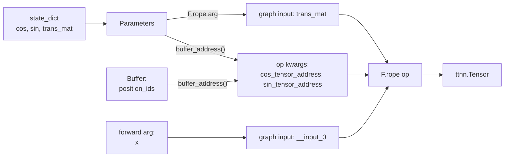

# Tensor lifetimes: Parameter / Buffer / GraphInput

Every `ttnn.Tensor` in a blaze-nn model has one of three lifetimes. The qwen3 port declares them up front in a module-docstring contract, and the rest of the port consistently maps each piece of state to exactly one category. Use this vocabulary whenever you talk about qwen3 — and adopt it for any new port, because the three categories cover everything blaze-nn knows how to plumb.

## The lifetimes contract (verbatim)

From `examples/qwen3_embedding_0_6b/modules/__init__.py:3-21`:

> This port uses three tensor lifetimes:
>
> - **Parameter** (`self.<name> = Parameter()`): frozen weight, present in `state_dict`, populated via `load_state_dict`. Either routed as a graph input via `F.<op>(..., self.weight, ...)` or read as a buffer address inside `forward()` and passed as an `int` kwarg (used by `embedding`, `rope`, `kv_cache_update`).
>
> - **Buffer** (`self.<name>: ttnn.Tensor | None = None` plus a `set_<name>`/`init_<name>` method): runtime state, **not** in `state_dict`, mutable by host writes. Used for the KV cache, `position_ids` (shared by reference between RoPE and SDPA), and the caller-allocated SDPA output tensor. Mutated in place via `ttnn.copy_host_to_device_tensor` between forwards so the `buffer_address()` baked into compile-time args remains valid.
>
> - **GraphInput**: arguments to `forward(...)`, wrapped by `GraphTracingContext.wrap_input`. Always a tensor port.

That contract is the spec. The rest of this section unpacks each lifetime with one concrete qwen3 example so you can identify which lifetime any new piece of state should adopt.

## Parameter — frozen weight in `state_dict`

A `Parameter` slot is created by `self.weight = Parameter()` (or by class-level `params = ("weight",)` on an `OpModule` subclass). It appears in `state_dict()`, is populated by `load_state_dict`, and never mutates afterwards. The qwen3 port has two flavors:

**Flavor 1 — Parameter routed as a graph input.** This is the default. `Qwen3MLP` (`examples/qwen3_embedding_0_6b/modules/mlp.py:12-31`) holds three Parameters and passes them positionally to `F.matmul`:

```python
class Qwen3MLP(Module):
    def __init__(self, cfg):
        super().__init__()
        self.gate_proj_weight = Parameter()
        self.up_proj_weight = Parameter()
        self.down_proj_weight = Parameter()

    def forward(self, hidden_states, **kwargs):
        gate = F.matmul(hidden_states, self.gate_proj_weight)
        up   = F.matmul(hidden_states, self.up_proj_weight)
        activated = F.gated_reduce(gate, up, activation="silu")
        return F.matmul(activated, self.down_proj_weight)
```

Each `self.<name>` passed into `F.<op>` is wrapped by `ctx.wrap_parameter` and shows up in the compiled graph as a port named after the attribute (`gate_proj_weight`, `up_proj_weight`, `down_proj_weight`). The compiler resolves the port to the actual `ttnn.Tensor` via the `tensors` dict.

**Flavor 2 — Parameter read as a buffer address inside `forward`.** When the kernel consumes a tensor by DRAM read rather than through a graph port — typical for ops with random-access patterns like embedding lookup, RoPE table reads, or kv-cache updates — the Parameter is dereferenced inside `forward()` and its address is passed as a plain `int` kwarg. `TokenEmbedding` (`examples/qwen3_embedding_0_6b/modules/token_embedding.py:19-33`) is the small canonical case:

```python
def forward(self, token_ids, **kwargs):
    weight_tensor = self._parameters["weight"]._tensor
    if weight_tensor is None:
        raise RuntimeError(...)
    weight_buffer_address = int(weight_tensor.buffer_address())
    weight_page_size = self.dim * 2
    merged = {"weight_buffer_address": weight_buffer_address, "weight_page_size": weight_page_size}
    merged.update(self._op_kwargs)
    merged.update(kwargs)
    return F.embedding(token_ids, **merged)
```

The crucial property: `weight_buffer_address` is a Python `int`, not a tensor. The tracing context does not wrap it — kwargs that are not `ttnn.Tensor` and not `TensorProxy` fall through unchanged into the compiler, which bakes them into the program's CT (compile-time) args. The address is now hard-coded into the compiled program. The Parameter still has to live in `state_dict` so `load_state_dict` populates it before the first `forward`; after that the Parameter object exists only to anchor the address.

The same flavor is used by `RoPE` for `cos` and `sin` (`examples/qwen3_embedding_0_6b/modules/rope.py:36-61`) — both are read by buffer address while `trans_mat` is a third Parameter routed as a real graph input. The op's `cos_tensor_address` / `sin_tensor_address` CT-args identify the DRAM banks the kernel will read each step.

## Buffer — runtime state, not in `state_dict`

A Buffer slot is declared as `self.<name>: ttnn.Tensor | None = None` and bound by a `set_<name>` or allocated by an `init_<name>` method. It is **not** in `state_dict` (no `Parameter()` wrapper) and it mutates between forwards. The qwen3 port uses Buffers for everything that's runtime state but not a forward argument:

- `Qwen3Attention.k_cache`, `Qwen3Attention.v_cache` — the KV cache (`modules/attention.py:52-53`).
- `Qwen3Attention.attn_out_tensor` — the caller-allocated SDPA output (`modules/attention.py:54`).
- `Qwen3Attention.qkv_out_tensor`, `Qwen3Attention.o_proj_out_tensor` — caller-allocated Linear outputs (`modules/attention.py:55-56`).
- `Qwen3EmbeddingModel.position_ids` and `RoPE.position_ids` — the same `ttnn.Tensor` object aliased into both (`modules/model.py:65`, `modules/rope.py:30`).

Several of those Buffers (`position_ids` and the KV caches), together with the `cos` / `sin` Parameters from the previous section, are consumed *by buffer address*. Their address is read once and baked into the compiled program's CT args; the kernel reads the DRAM bank at that address every time the program runs. That is the source of the buffer-address invariant:

> **Warning:** A Buffer's `ttnn.Tensor` object must not be reallocated after the first compile. The compiler reads `tensor.buffer_address()` once at compile time and bakes that integer into the program's CT args. If you reallocate the buffer (and ttnn hands you a fresh allocation at a different DRAM offset), every subsequent `program.run()` will read stale or invalid memory. Mutate buffers **in place** via `ttnn.copy_host_to_device_tensor(host_tensor, device_tensor)` — the wrapper object stays put.

This is why the port has `init_position_ids` (allocates) and `set_position_ids` (binds an existing tensor by reference) as two distinct hooks rather than re-allocating each step (see `modules/model.py:70-110`, covered in detail in [buffers_and_address_baking.md](buffers_and_address_baking.md)).

A Buffer is invisible to `state_dict` and `load_state_dict`. The qwen3 port relies on this: the L0 keys test asserts the exact key set from the weight loader, and a stray Buffer accidentally wrapped as a `Parameter()` would make that test fail loudly.

## GraphInput — a `forward` argument

Anything passed positionally or as a keyword to `forward(...)` is a **GraphInput**. `Module.__call__._call_graph` runs `ctx.wrap_input(a)` for each positional and keyword argument (`blaze_nn/modules/base.py:92-93`), which:

- If the argument is a `ttnn.Tensor`, registers it in the tracing context's `_tensor_bindings` under a fresh name (`__input_0`, `__input_1`, ...) and returns an `ExternalTensor(name)` proxy.
- If it is not a tensor (e.g. an `int` like `cur_pos`), returns it unchanged.

The compiled program then has one input port per tensor argument, resolved against the actual `ttnn.Tensor` at run time. `Qwen3Attention.forward` shows the pattern:

```python
def forward(
    self,
    hidden_states: Any,        # GraphInput: a ttnn.Tensor
    *,
    cur_pos: int,              # plain int; falls through compile-time
    cur_pos_tensor: Any,       # GraphInput: a ttnn.Tensor (the SDPA pos)
    residual: Any,             # GraphInput: a ttnn.Tensor (the residual)
    **kwargs: Any,
) -> Any:
```

`cur_pos_tensor` is the same `position_ids` Buffer aliased into the call site; it is wrapped as a GraphInput on every call so the SDPA op sees a fresh port, while the RoPE op reads its address as a CT-arg via the Buffer path. The same physical `ttnn.Tensor` plays both roles depending on which op it flows into.

## Putting the three together — one RoPE call

For a single decoder layer's RoPE call, the lifetimes assignment exercises all three categories in one slice:

```text
RoPE.forward(x, ...):
    cos_tensor            Parameter, buffer-address kwarg  (state_dict entry "cos")
    sin_tensor            Parameter, buffer-address kwarg  (state_dict entry "sin")
    trans_mat             Parameter, graph input            (state_dict entry "trans_mat")
    position_ids          Buffer, buffer-address kwarg      (not in state_dict)
    x                     GraphInput, tensor port           (forward argument)
```

Three out of five tensors are Parameters; one is a Buffer; one is a GraphInput. Two of the three Parameters (`cos`, `sin`) take the address path; one (`trans_mat`) flows as a real graph input. This is the single most representative slice of the qwen3 port — once you can classify each tensor here, the rest of the model reads quickly.



The Parameter / Buffer asymmetry is intentional: a Parameter's contents are constant for the model's lifetime (they change only with a fresh `load_state_dict`), while a Buffer's contents change between every forward — but in both cases the underlying `ttnn.Tensor` wrapper, and the DRAM/L1 **address** it reports, must stay the same after the first compile. Both end up baked into the compiled program; the difference is only what `state_dict` does with them.

## Choosing a lifetime — the decision tree

For each piece of state in a new module, ask in order:

1. **Is it a frozen weight that arrives in `state_dict` and never mutates?** → `Parameter`.
   - If the op consumes it through a graph port: pass it positionally to `F.<op>(..., self.weight)`.
   - If the op consumes it by DRAM read: pass `int(self.weight._tensor.buffer_address())` as a kwarg.
2. **Is it runtime state that mutates between forwards, but is the same object every call?** → `Buffer` (`self.<name> = None`, plus `init_<name>` and/or `set_<name>` hook).
3. **Is it a different tensor every call?** → `GraphInput` (a parameter of `forward`).

## Mutation idiom

In-place mutation of a Buffer's contents (with the wrapper object unchanged) is the supported escape hatch when you need to update what the kernel will read on the next `program.run()`. The canonical call is:

```python
ttnn.copy_host_to_device_tensor(host_tensor, device_tensor)
```

The `device_tensor` is the Buffer's `ttnn.Tensor`; its `buffer_address()` is unchanged; the bytes at that address are overwritten. The KV-cache update path uses the in-place variant `ttnn.kv_cache.update_cache_for_token_` (`modules/attention.py:159-160`) for the same reason.

> **For contributors:** the full path from `Module.__call__` to `BlazeCompiler.compile(...).run()` — and exactly when CT-args versus runtime tensors get resolved — is walked in Ch5 `module_call_path.md`. The `ExternalTensor` / `TensorProxy` wrappers used by `wrap_input` and `wrap_parameter` are in Ch5 `tensor_proxy.md`.

_Previous: [Layout and the weight loader](layout_and_weight_loader.md) · Next: [Composing submodules](composing_submodules.md) · [Up](index.md)_
