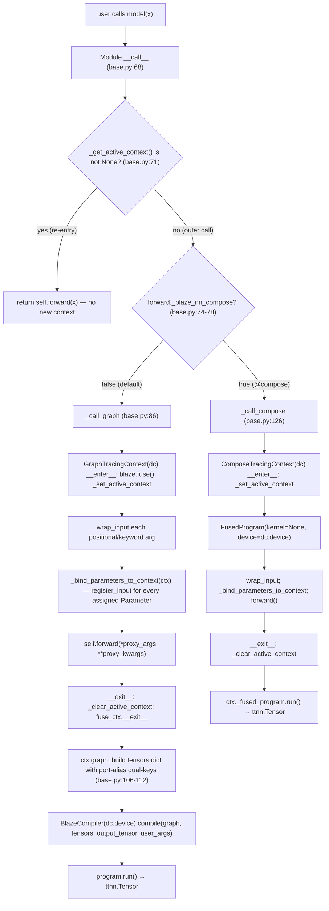

# The module call path: `model(x)` to `program.run()`

This section is the contributor-facing answer to the question Chapter 4 deliberately deferred: **what happens between the user's `model(x)` and the `ttnn.Tensor` that comes back?** Every step lives in `blaze_nn/modules/base.py`, lines 68–159. The path is short — five method bodies — but it threads through every later mechanism in this chapter and the next, so it pays to read carefully.

## The big picture



Every box in this diagram corresponds to either a method body in `base.py` or a context manager in `_tracing.py`. The two branches at `(C)` and `(E)` make the path entirely deterministic once you know two bits of state: whether a tracing context is already active, and whether the bound `forward` was decorated with `@blaze_nn.compose`. The next two subsections walk the two execution paths in order; the third names the four extension points that contributors hook.

## Outer-call dispatch in `Module.__call__`

The dispatcher is six lines (`blaze_nn/modules/base.py:68-82`). It does exactly two things: (a) short-circuit when we are already inside a tracing context, and (b) pick the right entry point based on the `@compose` flag.

```python
def __call__(self, *args, **kwargs):
    from .._tracing import _get_active_context
    if _get_active_context() is not None:
        return self.forward(*args, **kwargs)
    is_compose = getattr(
        getattr(type(self), "forward", None),
        "_blaze_nn_compose",
        False,
    )
    if is_compose:
        return self._call_compose(*args, **kwargs)
    return self._call_graph(*args, **kwargs)
```

The active-context check at `base.py:71` is the mechanism Chapter 4 named **Mechanism B**. It guarantees that when a `forward()` running inside an outer tracing context calls a child module (e.g. `self.input_layernorm(h)` inside `Qwen3DecoderLayer.forward`), the child's `__call__` does **not** open a second context — it just runs `forward` directly so the child's ops are emitted into the parent's `blaze.fuse()` graph. The orchestrator pattern (Mechanism A) in Chapter 4 was different: those modules override `__call__` themselves to skip the dispatcher entirely, ensuring no top-level context is opened so that host-side hops can interleave with sub-graphs.

The `_blaze_nn_compose` flag is set by the `@blaze_nn.compose` decorator (see `blaze_nn/__init__.py:38-48`) as a one-bit attribute on the `forward` function object. The `getattr(getattr(...))` chain is intentional — it reads the flag from the class (`type(self).forward`), not the bound method, so the lookup is cheap and never falls through `Module.__getattr__`.

## `_call_graph` line by line

`_call_graph` (`blaze_nn/modules/base.py:86-122`) is the default execution path — every qwen3 sub-module that runs as a standalone compile goes through here. The trace:

1. **`dc = self._resolve_device_config()`** (`base.py:89`, body at `base.py:249-254`). Reads `self._device_config`; raises `RuntimeError("... has no device. Call module.to(device) first.")` if `to(device)` was never called. The `DeviceConfig` carries the device handle plus the `all_cores` / `matmul_cores` / `sender_core` `GridConfig`s consumed later.
2. **`with GraphTracingContext(dc) as ctx:`** (`base.py:91`). Construction is pure Python (sets up `_tensor_bindings`, counters); the `__enter__` is where blaze gets touched — it opens `blaze.fuse()` and installs `self` as the module-level `_active_context` (see `tracing_contexts.md`).
3. **`proxy_args = tuple(ctx.wrap_input(a) for a in args)`** and the kwargs equivalent (`base.py:92-93`). Each positional/keyword argument is replaced with a fresh `TensorProxy` whose `_inner` is a `blaze.context.ExternalTensor("__input_<n>")` and whose `_name` is `"__input_<n>"`. The backing `ttnn.Tensor` is recorded in `ctx._tensor_bindings[name]` for the compiler to consume after the trace.
4. **`self._bind_parameters_to_context(ctx)`** (`base.py:95`, body at `base.py:148-151`). Iterates `self._parameters` (not children) and, for every Parameter with `_tensor is not None`, calls `ctx.register_input(name, param._tensor)`. The `name` is the attribute name `Module.__setattr__` set on the Parameter — this is the source of the `weight` / `gamma` graph-input port names. Inner-submodule Parameters are **not** bound here: under Mechanism B the inner submodule's `__call__` short-circuits straight to `forward` (`base.py:71-72`), so neither `_bind_parameters_to_context` nor `_call_graph` ever runs on the inner submodule. Instead, inner-submodule Parameters reach the parent context's `_tensor_bindings` via `functional._dispatch → ctx.wrap_parameter` on each `F.<op>(self.inner.weight, ...)` reference — the `if param._tensor is not None: self._tensor_bindings[name] = param._tensor` line at `_tracing.py:124-125` is what writes the binding.
5. **`output_proxy = self.forward(*proxy_args, **proxy_kwargs)`** (`base.py:96`). User code runs. Every `F.<op>(...)` call inside `forward` resolves the active context and emits a node into the `blaze.fuse()` graph. Nested `Module.__call__`s short-circuit through Mechanism B and emit into the same graph.
6. **`__exit__`** (`base.py:97` end of `with`). Clears the active context and finalizes `blaze.fuse()`. After this point, `ctx.graph` is a fully-built `BlazeGraph` and `ctx._tensor_bindings` is the input dict.
7. **Tensor dict with port-alias dual-keys** (`base.py:106-112`). The compiler has two consumers: fused-op `compose` functions look up by port name (e.g. `"input"`, `"in0"`), and the non-fused per-device path (`BlazeCompiler._build_cbs`) looks up by the original `ExternalTensor` name (`"__input_0"`, `"weight"`). To make both lookups work, the loop walks `graph.tensor_to_ports` and adds each port-name alias as a second key pointing to the same backing tensor:
   ```python
   tensors = dict(ctx._tensor_bindings)
   if hasattr(graph, "tensor_to_ports") and graph.tensor_to_ports:
       for tensor_name, ports in graph.tensor_to_ports.items():
           if tensor_name not in tensors:
               continue
           for _, port_name in ports:
               tensors.setdefault(port_name, tensors[tensor_name])
   ```
   The `setdefault` matters: if a user-provided name happens to coincide with a port name, the user wins.
8. **`output_tensor = self._get_output_tensor(args)`** (`base.py:114`). For a plain `Module` this is `args[0]` (an in-place alias on the first input). For an `OpModule` whose backing `BlazeOp` declares `user_allocated_outputs`, this is the tensor the user passed via `set_output_tensor` / `set_output_tensors`; see `caller_allocated_outputs_internals.md` in Chapter 6.
9. **`BlazeCompiler(dc.device).compile(...).run()`** (`base.py:115-122`). The compiler consumes the graph, the (now port-aliased) tensors dict, the output buffer, and the `user_args` dict from `_collect_user_args` (next subsection). Its return value is a `program` whose `run()` produces the final `ttnn.Tensor`.

> **Note:** `output_proxy` (the return value of `forward`) is captured but not returned — graph-mode programs write into `output_tensor`, and the proxy is only useful inside the trace. `_call_compose` returns the program's run result directly because compose-mode programs are self-contained.

## `_call_compose` line by line

`_call_compose` (`blaze_nn/modules/base.py:126-144`) is structurally parallel to `_call_graph` but uses a different context class and a different terminal call. The body itself:

```python
def _call_compose(self, *args, **kwargs):
    from .._tracing import ComposeTracingContext

    dc = self._resolve_device_config()
    with ComposeTracingContext(dc) as ctx:
        from blaze.fused_program import FusedProgram
        ctx._fused_program = FusedProgram(kernel=None, device=dc.device)

        proxy_args = tuple(ctx.wrap_input(a) for a in args)
        proxy_kwargs = {k: ctx.wrap_input(v) for k, v in kwargs.items()}
        self._bind_parameters_to_context(ctx)
        output_proxy = self.forward(*proxy_args, **proxy_kwargs)

    return ctx._fused_program.run()
```

The six structural beats:

1. `dc = self._resolve_device_config()` — same as graph mode.
2. `with ComposeTracingContext(dc) as ctx:` — the context's `__enter__` only installs `self` as `_active_context`; it does **not** call `blaze.fuse()`, because compose mode targets a pre-allocated `FusedProgram` rather than building a graph for the compiler to lower.
3. `ctx._fused_program = FusedProgram(kernel=None, device=dc.device)` — instantiated **inside** the `with` block so it lives only as long as the trace and so that `__enter__` returns before the program is known.
4. `wrap_input` / `_bind_parameters_to_context` / `forward` — identical shape to graph mode, but `wrap_input` returns a `TensorProxy` wrapping the device tensor itself, not an `ExternalTensor` placeholder. Every `F.<op>(...)` inside `forward` calls `BlazeOp._class_registry[op_name].emit(self._fused_program, ...)` (see `tracing_contexts.md`).
5. `__exit__` clears the active context. No graph fetch, no compiler — the `FusedProgram` is already populated by emit-time side effects.
6. `return ctx._fused_program.run()`.

> **Known gap.** Compose-mode has zero end-to-end test coverage; see [tracing_contexts.md, "Known gap: compose-mode coverage"](tracing_contexts.md) for the grep evidence and the contributor-facing test recipe.

## Four extension points

`_call_graph` and `_call_compose` call out to four `Module` methods that subclasses may override. Three are extension points contributors use; one is currently dormant.

### `_collect_user_args` — the `_ua_*` harvester

The base class returns `{}` (`base.py:153-154`). `OpModule` overrides it (`base.py:443-448`):

```python
def _collect_user_args(self) -> dict:
    args = {}
    for key in dir(self):
        if key.startswith("_ua_"):
            args[key[4:]] = getattr(self, key)
    return args
```

`dir(self)` is used (not `vars(self)`) so the harvester picks up class attributes as well as instance attributes — that is what lets qwen3's `FusedQKV` declare `_ua_blackhole_cores = "64x8"` at class level (`examples/qwen3_embedding_0_6b/modules/qkv_proj.py:29`) and have it reach the compiler. The full path is: `OpModule._ua_x = "v"` → `_collect_user_args` returns `{"x": "v"}` → passed as `user_args` to `BlazeCompiler.compile` → consumed by the op's `compose` classmethod via `user_args["x"]`. The Blackhole P150 monkey-patch in qwen3's `_blaze_nn_linear_patch.py` is exactly this consumer side.

### `_get_output_tensor` — caller-allocated outputs

The base implementation (`base.py:156-159`) returns `inputs[0]` if inputs are non-empty, else `None` — i.e. it aliases the output buffer to the first input, matching tt-blaze's in-place op convention. `OpModule._get_output_tensor` (`base.py:406-411`) overrides this for ops that declared `user_allocated_outputs`: it returns the tensor(s) the user previously passed to `set_output_tensor` / `set_output_tensors`, single-tensor for a one-port op and a tuple for multi-port. The pre-forward check at `base.py:417-423` raises `RuntimeError("has unset required output tensor(s): ...")` when an `OpModule` is invoked without the required `set_output_tensor[s]` call. The full chain (`_lookup_user_allocated_outputs` ↔ `OpModule.__init__` ↔ `define_fused_op`) is the subject of Chapter 6 `caller_allocated_outputs_internals.md`.

### `_compiled_cache` — currently dormant

`Module.__init__` allocates an empty dict at `base.py:30`: `object.__setattr__(self, "_compiled_cache", {})`. Nothing in the framework reads or writes this dict today. Searching for `_compiled_cache` outside the constructor (`grep -rn _compiled_cache /home/ttuser/salnahari/blaze-nn/`) turns up exactly one hit — that constructor line. **Flag as a future-extension hook:** the intended use is per-shape compile-result caching so that repeated calls with the same input shapes skip the `BlazeCompiler.compile` step (which is far more expensive than `program.run()`). Contributors landing such a cache should key on the trace inputs' shapes + `user_args`, not on object identity, and should invalidate on `module.to(device)` re-binds. The natural insertion site is between `ctx.graph` extraction and `BlazeCompiler.compile` at `base.py:115`. Do not depend on its presence today, and do not populate it speculatively.

_Previous: [Chapter 4 — Authoring models: the Qwen3 walkthrough](../ch4_qwen3_walkthrough/buffers_and_address_baking.md) · Next: [Tracing contexts: `TracingContext`, `GraphTracingContext`, `ComposeTracingContext`](tracing_contexts.md) · [Up](index.md)_
