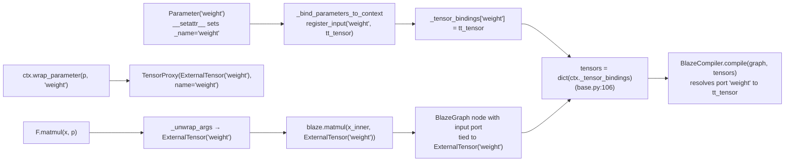

# `TensorProxy`: the opaque handle

`blaze_nn/_tensor_proxy.py` is the smallest file in the package — 28 lines, one class, two slots, no methods beyond `__init__` and `__repr__`. Its job is to be **the only object type that flows between `F.<op>` calls inside a traced `forward`**. Every other type users might want — `ExternalTensor`, `FusionResult`, raw `ttnn.Tensor`, `BlazeOp` result handles — is hidden behind it.

## The full class

```python
class TensorProxy:
    """Opaque handle representing an intermediate tensor during tracing.

    Users never construct or inspect these directly — they are returned
    by blaze_nn.functional ops and passed as inputs to subsequent ops.
    """

    __slots__ = ("_inner", "_name")

    def __init__(self, inner: Any, name: str = ""):
        self._inner = inner
        self._name = name

    def __repr__(self) -> str:
        return f"TensorProxy({self._name!r})"
```

That is the entire implementation (`blaze_nn/_tensor_proxy.py:14-28`). Two fields, both single-underscored to signal "do not touch from outside the framework". One repr that prints only the `_name` — `_inner` is deliberately not shown so accidentally printing a long chain of proxies in a test failure does not produce a wall of `BlazeGraph` internals. The opacity is enforced by convention and by the contexts: `TracingContext._unwrap_args` is the one place in the framework that reads `_inner`.

The module docstring at `blaze_nn/_tensor_proxy.py:1-7` calls out the two-mode wrapping responsibility directly:

> "TensorProxy wraps the backend-specific handle (`FusionResult` in graph mode, `CBHandle` in compose mode) so that functional ops can pass results between each other without the user knowing the underlying type."

## Why `__slots__`

The `__slots__` declaration is not a micro-optimization — it is a memory budget choice grounded in how tracing actually allocates objects. Every input, every parameter, and every op result during a trace produces one `TensorProxy`. For a qwen3 decoder layer:

| Source | Count per forward |
|---|---|
| `wrap_input` for positional / kwarg arguments | ~5–10 (hidden states, position ids, KV cache handles) |
| `wrap_parameter` for bound parameters | ~10 (norms, projections, gates) |
| `dispatch` per `F.<op>` call | ~20–30 (matmuls, residuals, RoPE, attention) |

A single decoder-layer compile mints roughly 35–50 proxies. Multiply by 28 layers and by every per-step compile across decode, and the count climbs into the thousands per token. None of these proxies survives the `with GraphTracingContext(...)` block — they are pure tracing scratch.

`__slots__` saves two costs on each one:

1. **The per-instance `__dict__`**, which on CPython 3.11+ adds ~100 bytes for an otherwise-empty object.
2. **The keysharing dict overhead** when the same attribute names get assigned at construction; attribute access becomes a fixed-offset pointer load rather than a hash lookup.

For two-field objects allocated in their thousands and freed immediately, declaring `__slots__ = ("_inner", "_name")` cuts the per-object footprint by roughly half and avoids touching the dict-of-strings interning machinery. The trade-off — no dynamic attribute assignment — is exactly the property the framework wants: the class is closed, and any attempt to attach extra metadata at trace time is a code smell that `__slots__` will surface as an `AttributeError`. The slot declaration is also a soft documentation hint: `TensorProxy` carries exactly these two pieces of state and nothing else; do not extend it by attaching ad-hoc attributes.

> **Note:** `__slots__` also disables weak references unless `__weakref__` is explicitly listed. `TensorProxy` does not list it, so users cannot create `weakref.ref(proxy)`. This is intentional — proxies are not meant to be tracked across the trace boundary.

## The `_inner` invariant: who reads it, who doesn't

`_inner` holds the backend-specific handle. The exact type varies by tracing mode:

| Producer | `_inner` type | Source |
|---|---|---|
| `GraphTracingContext.wrap_input` | `blaze.context.ExternalTensor` | `_tracing.py:115-119` |
| `GraphTracingContext.wrap_parameter` | `blaze.context.ExternalTensor` | `_tracing.py:121-126` |
| `GraphTracingContext.dispatch` | `FusionResult` from `op_handle(...)` | `_tracing.py:149-150` |
| `ComposeTracingContext.wrap_input` | the raw `ttnn.Tensor` itself | `_tracing.py:167-170` |
| `ComposeTracingContext.wrap_parameter` | the Parameter's bound `ttnn.Tensor` | `_tracing.py:172-178` |
| `ComposeTracingContext.dispatch` | `op_cls.emit(...)` result (e.g. `CBHandle`) | `_tracing.py:195-196` |

The framework reads `_inner` in exactly one method: `TracingContext._unwrap_args` (`blaze_nn/_tracing.py:70-80`). Tracing the call paths:

- A `F.<op>(proxy_a, proxy_b)` call lands in `_dispatch` (`functional.py:24`), which **pre-wraps any raw `Parameter` argument** via `ctx.wrap_parameter(a, a._name)` (`functional.py:36-43`) and then calls `ctx.dispatch(backend, ...)` with all `Parameter`s already promoted to `TensorProxy`.
- `dispatch` calls `self._unwrap_args(args)`. On the live `F.<op>` path this means: `TensorProxy` → `_inner`; raw `Parameter` (only when something bypassed `functional._dispatch`) → wrap-then-extract via `wrap_parameter(a, a._name)._inner`.
- The unwrapped list is passed positionally to the backend op handle (graph mode) or `op_cls.emit` (compose mode).

> **For contributors:** if you find yourself wanting to inspect `_inner` from inside `blaze_nn/`, the right move is almost always to add a method on `TracingContext` rather than to read the field directly. The only legitimate consumers today are `_unwrap_args` and `wrap_*` (which write, not read). Anything else is a layering violation.

## The `_name` field connects proxies to port names

`_name` is the second slot. It is set at construction and never mutated. Its value depends on the source. Three name forms flow through the same `_name` slot:

- **`wrap_input` proxies**: `_name = "__input_0"`, `"__input_1"`, ... — the synthetic names produced by `TracingContext._next_input_name`. These become keys in `ctx._tensor_bindings`, and the compiler reads them as graph-input port names alongside the port aliases added in `Module._call_graph` (`base.py:106-112`).
- **`wrap_parameter` proxies**: `_name = attr_name` — the attribute name `Module.__setattr__` assigned to the Parameter (`base.py:35-38`, `value._name = name`). So a model with `self.weight = Parameter()` gets a proxy named `"weight"` whenever `weight` is wrapped, and `"weight"` appears as a graph-input port. This is the source of the `"weight"`/`"gamma"` named inputs that the qwen3 walkthrough in Chapter 4 referred to as "Parameter ports".
- **`dispatch` proxies**: `_name = blaze_kwargs["ct_prefix"]`, which defaults to `"<op>_<n>"` via `_next_prefix`. So the proxy returned by the first `F.matmul(...)` in a trace is named `"matmul_1"`, the second `"matmul_2"`, etc.

The lineage of a Parameter-derived port name is worth diagramming because it is the one path that ties Chapter 2's Parameter machinery to this chapter's compiler hand-off:



The dispatch-proxy form (op prefix names) shows up directly in the test suite. `tests/test_dispatch_integration.py:test_chained_ops_create_edge` asserts:

```python
edges = [
    (e.producer.id, e.producer_port, e.consumer.id, e.consumer_port)
    for e in ctx.graph.edges
]
assert edges == [("rmsnorm_1", "output", "matmul_1", "in0")]
```

After the `with` block exits the graph contains nodes named `rmsnorm_1` and `matmul_1` (these come from `ct_prefix` in `GraphTracingContext.dispatch`, threaded through to the `FusionResult` and surfaced as `proxy._name`); the edge connects the output port of `rmsnorm_1` to the `in0` port of `matmul_1`.

Two of those name forms — input names and parameter attribute names — also live as keys in `ctx._tensor_bindings`, which becomes the `tensors` dict for `BlazeCompiler.compile`. That dict gets duplicate-keyed by port name (`base.py:107-112`, the "port-alias dual-key" walked in [module_call_path.md](module_call_path.md)) so that whichever lookup the compiler performs — by original `ExternalTensor` name or by port name — finds the binding.

Two convenience properties of this scheme:

1. **`Parameter._name` round-trips through tracing.** Chapter 2 (`parameter.md`) noted that `Parameter._name` is set by `Module.__setattr__` and used as the graph-input port name during tracing. The connection is this: `Module._bind_parameters_to_context` calls `ctx.register_input(name, param._tensor)` keyed by the attribute name, and `wrap_parameter` returns a proxy whose `_name` is the same attribute name. The two-step flow keeps the port-name string in exactly one place: the Parameter's attribute name on its owning Module.
2. **The proxy's `__repr__` is debug-friendly.** `f"TensorProxy({self._name!r})"` prints `TensorProxy('matmul_3')` or `TensorProxy('weight')` — enough to identify which trace-time tensor went wrong when an exception fires inside `forward`. Contributors landing new tracing features should preserve this property; do not switch the repr to include `_inner` (its repr can be expensive or even raise).

> **Warning:** Do not construct or introspect `TensorProxy` from user code. Only `ctx.wrap_input`, `ctx.wrap_parameter`, and `ctx.dispatch` may produce one — they pair the proxy with a `_tensor_bindings` write and pick the mode-correct `_inner` per the invariant table above. Reading `_inner` outside `_unwrap_args` is a layering violation.

## Cross-references

- `_unwrap_args` is the only sanctioned `_inner` reader — see [tracing_contexts.md](tracing_contexts.md), "`_unwrap_args`: how `F.*` ops see backend handles".
- The `_name` → port-name flow is what makes the `tensors` dict construction at `blaze_nn/modules/base.py:106-112` correct — see [module_call_path.md](module_call_path.md), "`_call_graph` line by line", step 7.
- The functional dispatcher that produces `TensorProxy` chains is covered next in Chapter 6 `functional_dispatch.md`.

_Previous: [Tracing contexts: `TracingContext`, `GraphTracingContext`, `ComposeTracingContext`](tracing_contexts.md) · Next: [Chapter 6 — Op dispatch, the registry, and caller-allocated outputs](../ch6_dispatch_and_registry/index.md) · [Up](index.md)_
