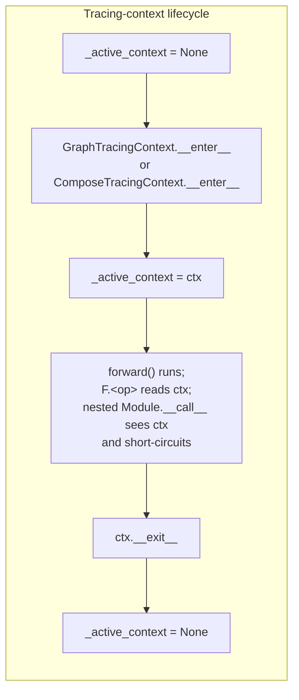
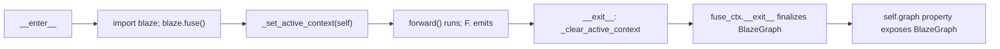

# Tracing contexts: `TracingContext`, `GraphTracingContext`, `ComposeTracingContext`

`blaze_nn/_tracing.py` is 196 lines and contains three classes plus three module-level helpers. This is the file that decides what `F.<op>(...)` actually does — every functional op in `blaze_nn/functional.py` reaches into the active context to emit a node. The implementation is split into a small abstract base (`TracingContext`) and two concrete subclasses (`GraphTracingContext` for the default path, `ComposeTracingContext` for `@compose`).

## The module-level active context

The first 35 lines of `_tracing.py` (`blaze_nn/_tracing.py:20-34`) define the global handle:

```python
_active_context: Optional[TracingContext] = None

def _get_active_context() -> Optional[TracingContext]:
    return _active_context

def _set_active_context(ctx: TracingContext) -> None:
    global _active_context
    _active_context = ctx

def _clear_active_context() -> None:
    global _active_context
    _active_context = None
```

This is a **single module-level global**, set on `__enter__` and cleared on `__exit__`. The module docstring (`_tracing.py:7-8`) is explicit: *"The context is a module-level global — same single-threaded assumption as Blaze's own `_active_context`."* Contributors writing parallel test harnesses should be aware: there is no per-thread or per-coroutine isolation, and there is no nested-context stack — the second `__enter__` overwrites the first.



> **Warning:** Do not run two `_call_graph` traces concurrently from different threads. The second thread will clobber the first's `_active_context`, and the first's `F.<op>` calls will start emitting into the second's graph. Single-threaded use is enforced only by convention; tests rely on the fact that pytest runs serially. If you need concurrent compiles, run them in separate processes — adding locking on the blaze-nn side is defence-in-depth against a problem the lower stack does not solve either.

The active context is read in three places: `Module.__call__` (`base.py:71`) for the re-entry short-circuit, `OpModule.__call__` (`base.py:416`) for the unset-output-tensor pre-check, and `blaze_nn.functional._dispatch` (`functional.py:27`) where every `F.<op>` call lives. Cross-references to the dispatch path are in Chapter 6 `functional_dispatch.md`.

## The shared base class

`TracingContext` (`_tracing.py:37-90`) provides state and helpers that both subclasses use. The state:

| Field | Purpose |
|---|---|
| `device_config` | Stashed for `_resolve_grid`; passed in by `Module._call_graph` / `_call_compose`. |
| `_tensor_bindings: dict[str, Any]` | Maps input/port names (`"__input_0"`, `"weight"`, ...) to the backing `ttnn.Tensor`. Consumed by the compiler. |
| `_input_counter`, `_op_counter` | Monotonically incremented to produce fresh names. |
| `_output_proxy` | Reserved field; not used by either subclass today. |

The four abstract / utility methods:

- `register_input(name, device_tensor)` — write a binding without minting a proxy. Used by `Module._bind_parameters_to_context` to attach parameter tensors to the context.
- `wrap_input(device_tensor)` — abstract in the base; subclasses produce a `TensorProxy`.
- `wrap_parameter(param, attr_name)` — abstract in the base; subclasses produce a `TensorProxy` for a Parameter, using its attribute name as the port name.
- `dispatch(op_name, *args, **kwargs)` — abstract; the per-op emit entry point.

The two name generators are trivial but worth pinning:

```python
def _next_input_name(self) -> str:
    name = f"__input_{self._input_counter}"
    self._input_counter += 1
    return name

def _next_prefix(self, op_name: str) -> str:
    self._op_counter += 1
    return f"{op_name}_{self._op_counter}"
```

The op-counter increments **before** formatting, so the first node of any op is `<op>_1`, not `<op>_0`. This is observable in `tests/test_dispatch_integration.py:test_chained_ops_create_edge`, where the produced edge is `("rmsnorm_1", "output", "matmul_1", "in0")`.

### `_unwrap_args`: how `F.*` ops see backend handles

`_unwrap_args` (`_tracing.py:70-80`) converts a tuple of trace-time values into a list of backend-native arguments:

```python
def _unwrap_args(self, args: tuple) -> list:
    out = []
    for a in args:
        if isinstance(a, TensorProxy):
            out.append(a._inner)
        elif isinstance(a, Parameter):
            out.append(self.wrap_parameter(a, a._name)._inner)
        else:
            out.append(a)
    return out
```

Three cases: `TensorProxy` → unwrap to `_inner` (an `ExternalTensor` for graph mode or a device tensor for compose mode); raw `Parameter` → wrap it just-in-time; anything else passes through. The `Parameter` branch is the safety net that lets `F.matmul(x, self.weight)` work even when `dispatch` is called outside the `functional._dispatch` path (e.g. a contributor invoking `ctx.dispatch` from inside the framework). On the live `F.<op>` path, every `Parameter` argument is already wrapped into a `TensorProxy` by `functional._dispatch` (`functional.py:36-43`) **before** `ctx.dispatch` runs, so the `isinstance(a, Parameter)` branch is unreachable from the user-facing path — it only fires when something bypasses `_dispatch`.

### `_resolve_grid`: the grid-priority rule

`_resolve_grid` (`_tracing.py:82-90`) chooses which `GridConfig` to pass as the `grid=` kwarg:

```python
def _resolve_grid(self, backend_op: str, explicit_grid: Any) -> Any:
    if explicit_grid is not None:
        return explicit_grid
    if self.device_config is None:
        return None
    if uses_matmul_cores(backend_op):
        return self.device_config.matmul_cores
    return self.device_config.all_cores
```

The priority is:

1. **Explicit `_grid` kwarg wins.** A user can pass `F.matmul(x, w, _grid=my_grid)` to override. The kwarg name has a leading underscore to keep it out of the kwargs that reach the backend op. It is popped off `kwargs` in `GraphTracingContext.dispatch` at `_tracing.py:136`.
2. **`device_config is None` → `None`.** When no `DeviceConfig` was attached (typical for dispatch-integration tests that construct a context directly), the registry is **not** consulted and grid resolution returns `None`. The backend op receives `grid=None` and falls back to its own default. This rung is what makes `tests/test_dispatch_integration.py` runnable without a real device.
3. **Otherwise consult the registry.** `uses_matmul_cores(backend_op)` reads `_REGISTRY` from `blaze_nn/_registry.py`. If the op is flagged (currently `matmul`, `kn_sliced_matmul`, `residual_add` — the three entries with `uses_matmul_cores=True` at `_registry.py:40-42`), use `device_config.matmul_cores`.
4. **Default to `all_cores`.** Every other op runs on the full device grid.

> **For contributors:** the three flags in `OpInfo` (`backend`, `uses_matmul_cores`, `needs_sender_core`) and the decision tree for adding a new entry are covered in Chapter 6 `registry.md`. The `needs_sender_core` flag is consumed in `GraphTracingContext.dispatch` (next subsection), not in `_resolve_grid`. The current `_REGISTRY` flags only `mcast` for `needs_sender_core`.

## `GraphTracingContext`: the default path

`GraphTracingContext` (`_tracing.py:93-150`) is the context every plain `_call_graph` opens. The defining feature is that `__enter__` opens a `blaze.fuse()` block, so every backend op call recorded during the trace lands in the resulting `BlazeGraph`.

### Lifecycle

```python
def __enter__(self) -> GraphTracingContext:
    import blaze
    self._fuse_ctx = blaze.fuse()
    self._fuse_ctx.__enter__()
    _set_active_context(self)
    return self

def __exit__(self, exc_type, exc_val, exc_tb) -> None:
    _clear_active_context()
    self._fuse_ctx.__exit__(exc_type, exc_val, exc_tb)
```



`blaze.fuse()` returns a context manager that, while open, accumulates `F.<op>` calls into a `BlazeGraph`. The ordering on `__exit__` — singleton cleared *first*, then `blaze.fuse()` closed — keeps the active context valid for the duration of any cleanup that fires during exception unwinding, then releases it. `ctx.graph` (`_tracing.py:111-113`) is a thin property that reads `self._fuse_ctx.graph`; the graph is only fully populated after `__exit__` runs, which is why `Module._call_graph` reads `ctx.graph` *after* the `with` block exits (`base.py:100`).

### `wrap_input` and `wrap_parameter`

`wrap_input` (`_tracing.py:115-119`) mints a fresh `ExternalTensor` and binds the device tensor:

```python
def wrap_input(self, device_tensor: Any) -> TensorProxy:
    from blaze.context import ExternalTensor
    name = self._next_input_name()
    self._tensor_bindings[name] = device_tensor
    return TensorProxy(ExternalTensor(name), name=name)
```

`wrap_parameter` (`_tracing.py:121-126`) does the same but keys by the Parameter's attribute name (`weight`, `gamma`, ...) rather than `__input_<n>`. This is what gives the compiler human-readable port names for parameters:

```python
def wrap_parameter(self, param: Parameter, attr_name: str) -> TensorProxy:
    from blaze.context import ExternalTensor
    name = attr_name
    if param._tensor is not None:
        self._tensor_bindings[name] = param._tensor
    return TensorProxy(ExternalTensor(name), name=name)
```

If `param._tensor is None` (parameter never assigned), the binding is skipped but the `ExternalTensor` is still produced — useful for dispatch-integration tests that build graphs without real tensors. In production the graph still builds; the failure surfaces in `BlazeCompiler.compile` as the "missing tensor for port X" error.

### `dispatch`: the per-op emit entry point

`dispatch` (`_tracing.py:128-150`) is where backend ops are actually called:

```python
def dispatch(self, op_name, *args, **kwargs):
    import blaze
    op_handle = getattr(blaze, op_name, None)
    if op_handle is None:
        raise ValueError(f"Unknown blaze op: {op_name}")
    unwrapped_args = self._unwrap_args(args)
    grid = self._resolve_grid(op_name, kwargs.pop("_grid", None))
    blaze_kwargs = dict(kwargs)
    if ("sender" not in blaze_kwargs
            and self.device_config is not None
            and needs_sender_core(op_name)):
        blaze_kwargs["sender"] = self.device_config.sender_core
    if "ct_prefix" not in blaze_kwargs:
        blaze_kwargs["ct_prefix"] = self._next_prefix(op_name)
    result = op_handle(*unwrapped_args, grid=grid, **blaze_kwargs)
    return TensorProxy(result, name=blaze_kwargs.get("ct_prefix", op_name))
```

The body has five distinct steps:

1. **Resolve op handle** — `getattr(blaze, op_name, None)`. If the name is not in the `blaze` module's top-level namespace (which mirrors `BlazeOp._class_registry` for registered ops), raise `ValueError("Unknown blaze op")`. This is the error `tests/test_dispatch_integration.py:test_unknown_op_raises` asserts.
2. **Unwrap args** — call `_unwrap_args` from the base class. By the time blaze sees them, every `TensorProxy` is `ExternalTensor` and every Parameter is also `ExternalTensor`.
3. **Resolve grid** — `kwargs.pop("_grid", None)` strips the user-facing kwarg before it can leak to blaze, then the registry decides. The popped `_grid` becomes the `explicit_grid` argument to `_resolve_grid`.
4. **Inject `sender`** — only when `device_config is not None` (so dispatch-integration tests with `device_config=None` don't trip) and `needs_sender_core` flags the op. The current registry sets this flag only for `mcast`.
5. **Auto-assign `ct_prefix`** — if the user didn't pass one, mint `<op>_<n>`. This is the node name visible in `BlazeGraph` (the `node.spec.name` and the producer/consumer IDs that show up in `tests/test_dispatch_integration.py`).

The return value is a `TensorProxy` whose `_inner` is whatever `op_handle(...)` returned (typically a `FusionResult`) and whose `_name` is the `ct_prefix` — that name is what shows up in the proxy's `__repr__`.

## `ComposeTracingContext`: the pre-fused-program path

`ComposeTracingContext` (`_tracing.py:153-196`) is structurally similar but skips `blaze.fuse()`. The `__enter__` only installs the active context:

```python
def __enter__(self):
    _set_active_context(self)
    return self

def __exit__(self, exc_type, exc_val, exc_tb):
    _clear_active_context()
```

The `_fused_program` field is populated **outside** the context (in `Module._call_compose`, `base.py:131-136`) so that the lifetime is tied to the `with` block but the program object is constructed by the caller.

### `wrap_input` returns the device tensor itself

```python
def wrap_input(self, device_tensor: Any) -> TensorProxy:
    name = self._next_input_name()
    self._tensor_bindings[name] = device_tensor
    return TensorProxy(device_tensor, name=name)
```

The `_inner` is the device tensor, not an `ExternalTensor` placeholder. Compose mode emits into an already-allocated `FusedProgram`, so blaze ops see real tensors immediately.

### `wrap_parameter` requires a populated tensor

```python
def wrap_parameter(self, param, attr_name):
    if param._tensor is not None:
        return TensorProxy(param._tensor, name=attr_name)
    raise RuntimeError(
        f"Parameter '{attr_name}' has no tensor assigned. "
        "Assign a ttnn.Tensor via load_state_dict() or .data before forward()."
    )
```

The raise is louder than `GraphTracingContext.wrap_parameter` because compose mode has no deferral — there is no compiler to consume the binding later; the parameter is needed immediately.

### `dispatch` routes through `BlazeOp._class_registry`

```python
def dispatch(self, op_name, *args, **kwargs):
    from blaze.blaze_op import BlazeOp
    op_cls = BlazeOp._class_registry.get(op_name)
    if op_cls is None:
        raise ValueError(f"Unknown blaze op: {op_name}")
    prefix = kwargs.pop("_prefix", None) or self._next_prefix(op_name)
    kwargs.pop("_grid", None)  # symmetry with graph mode; unused
    unwrapped = self._unwrap_args(args)
    emit_kwargs = {"prefix": prefix}
    emit_kwargs.update(kwargs)
    result = op_cls.emit(self._fused_program, *unwrapped, **emit_kwargs)
    return TensorProxy(result, name=prefix)
```

Three differences from graph mode worth flagging:

1. **Lookup is `BlazeOp._class_registry[op_name]`**, not `getattr(blaze, op_name)`. These are *almost* equivalent (the `blaze` module exposes registered ops as top-level names), but the registry is the source of truth.
2. **`_grid` is popped and discarded.** Compose-mode programs already have their kernels assigned, so grid is fixed; the kwarg is accepted only for symmetry with graph mode so user code can be written once.
3. **The call is `op_cls.emit(self._fused_program, ...)`.** Side effect: the op writes into the `FusedProgram`. Return: a tensor handle that the next op consumes.

> **For contributors:** the prefix kwarg is spelled **`_prefix`** in compose mode and **`ct_prefix`** in graph mode. A minor asymmetry, but worth noting if you are porting a `forward` between modes — the user-facing override name differs.

## Known gap: compose-mode coverage

`grep -rn compose /home/ttuser/salnahari/blaze-nn/tests/` returns **no matches** — neither the verb form nor the `_blaze_nn_compose` attribute is named anywhere in the test tree. The unit tests under `tests/test_module.py` cover `_call_graph` thoroughly; `tests/test_dispatch_integration.py` exercises `GraphTracingContext` end-to-end with a real tt-blaze install; nothing in the suite drives a full `model(x)` with `@blaze_nn.compose` on `forward`. Until that lands, the compose-mode code path is best understood as "structurally parallel to graph mode but engineered around a `FusedProgram` rather than a `BlazeGraph`" — the structural symmetry is reassuring but not a substitute for an integration test. Contributors taking on a new compose-mode backend should add a `pytest.importorskip("blaze")` test that asserts: (a) `ComposeTracingContext.__enter__` sets the active context, (b) `wrap_input` returns the device tensor as `_inner`, (c) `dispatch` reaches `op_cls.emit` with the expected prefix and kwargs against a stub `FusedProgram`, and (d) `program.run()` produces a tensor.

## When to choose which

Graph mode is the default and what every qwen3 sub-module uses — the trace builds a graph, the compiler lowers it, and the result is a per-call (per-shape) compiled program. Compose mode is reserved for topology-fixed pre-fused programs where the kernel is decided ahead of tracing; in practice it is unused in-tree. Users opt in via `@blaze_nn.compose` on `forward`; the dispatcher at `base.py:74-78` reads the flag.

_Previous: [The module call path: `model(x)` to `program.run()`](module_call_path.md) · Next: [`TensorProxy`: the opaque handle](tensor_proxy.md) · [Up](index.md)_
