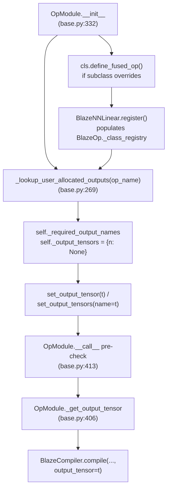

# Caller-allocated outputs — internals

Some tt-blaze ops cannot allocate their own output buffer. `Linear`'s fused mcast → matmul → gather, for example, writes into a buffer whose memory config and shard spec the caller chose: the gather step needs a pre-allocated `ttnn.Tensor` with the right interleaved layout. `SDPADecode` after the Qwen3 monkey-patch is the other in-tree case.

[Chapter 3's `output_tensors.md`](../ch3_containers_and_opmodule/output_tensors.md) introduced the user-level rule ("call `set_output_tensor(...)` before `forward()`, or you get a `RuntimeError`"). This page walks the full internal chain that makes the rule work: `_lookup_user_allocated_outputs`, `_required_output_names`, `set_output_tensor[s]`, `_get_output_tensor`, the pre-forward check, and the `define_fused_op` hook that lets a `Module` subclass synthesize its own fused `BlazeOp`. Two pitfalls follow.

## The chain at a glance



Five files participate: `blaze_nn/modules/base.py` (the bulk), `blaze_nn/modules/linear.py` (the canonical synthesis case), tt-blaze (`BlazeOp._class_registry`), `examples/qwen3_embedding_0_6b/` (the monkey-patch path), and `tests/test_op_module.py` plus `tests/test_pytorch_parity.py` (the pins). Everything other than the tt-blaze registry lookup happens inside blaze-nn itself.

## Step 1 — `_lookup_user_allocated_outputs(op_name)`

The chain starts in `blaze_nn/modules/base.py:269`:

```python
def _lookup_user_allocated_outputs(op_name: str) -> tuple[str, ...]:
    if not op_name:
        return ()
    try:
        from blaze.blaze_op import BlazeOp
    except ImportError:
        return ()
    op_cls = BlazeOp._class_registry.get(op_name)
    if op_cls is None:
        return ()
    return tuple(getattr(op_cls, "user_allocated_outputs", ()))
```

This is a one-time read at `OpModule.__init__` time. Four exit conditions all return the empty tuple, which is the "no caller-allocated outputs required" sentinel:

1. Empty `op_name` — defensive against `OpModule()` constructions that have not set their op name yet.
2. `blaze` is not importable — the framework-only test tier with `object()` sentinels never sees a real registry.
3. The op name is not in `BlazeOp._class_registry` — covers misspelled op names and aliases that have not been resolved.
4. The op class is registered but does not declare `user_allocated_outputs` — the common case.

Only the fourth branch (op class exists and declares the attribute) returns a non-empty tuple. `Linear`'s op class declares `user_allocated_outputs = ("output",)` (see [Step 5](#step-5--define_fused_op-and-_fused_op_defined-for-idempotence)); `SDPADecode` declares the same after Qwen3's monkey-patch.

> **Note:** The function reads `user_allocated_outputs` once, at OpModule construction. The result is stored in `self._required_output_names`; the registry is never re-read during `forward()`. This is the source of pitfall #2 below.

## Step 2 — `OpModule.__init__` consumes the tuple

In `blaze_nn/modules/base.py:332`:

```python
# (inside OpModule.__init__)
op_name = op if op is not None else type(self).op
slot_names = tuple(params) if params is not None else tuple(type(self).params)

object.__setattr__(self, "_op_name", op_name)
object.__setattr__(self, "_param_slots", slot_names)
object.__setattr__(self, "_op_kwargs", dict(op_kwargs))

required_outputs = _lookup_user_allocated_outputs(op_name)
object.__setattr__(self, "_required_output_names", required_outputs)
object.__setattr__(self, "_output_tensors", {n: None for n in required_outputs})
```

After this runs the `OpModule` instance carries two pieces of state that drive the rest of the chain:

- `_required_output_names: tuple[str, ...]` — frozen at construction, equal to whatever the op class declared (or `()`). Read by `_get_output_tensor`, by `set_output_tensor`'s arity check, and by the pre-forward enforcement in `__call__`.
- `_output_tensors: dict[str, Any]` — one entry per declared output port, initialized to `None`. Each entry is filled by either `set_output_tensor(t)` (the single-output convenience) or `set_output_tensors(name=t, ...)` (the multi-output form).

Three reasons this lives on the **instance** rather than the class: (a) different `Linear` instances will be configured with different memory configs and therefore different output buffers; (b) the dict is mutable, which it must be for `set_output_tensor` to work; (c) freezing the **names** at construction lets `forward()` raise an actionable error before dispatch ever happens.

## Step 3 — `set_output_tensor` and `set_output_tensors`

The two setters share the same internal dict but enforce different arity constraints. `set_output_tensor` is at `blaze_nn/modules/base.py:382`; `set_output_tensors` is at `blaze_nn/modules/base.py:396`:

```python
def set_output_tensor(self, tensor: Any) -> None:
    if len(self._required_output_names) != 1:
        raise ValueError(
            f"{type(self).__name__} declares "
            f"{len(self._required_output_names)} user-allocated outputs "
            f"{self._required_output_names}; use set_output_tensors(...)."
        )
    self._output_tensors[self._required_output_names[0]] = tensor

def set_output_tensors(self, **tensors: Any) -> None:
    for name, tensor in tensors.items():
        if name not in self._output_tensors:
            raise KeyError(
                f"{type(self).__name__} has no user-allocated output "
                f"'{name}'. Expected one of: {self._required_output_names}"
            )
        self._output_tensors[name] = tensor
```

`set_output_tensor(t)` is the single-output convenience used by `Linear` (which declares one port, `"output"`) and by `OpModule(op="sdpa_decode")` after Qwen3's monkey-patch (which also declares one port). It raises `ValueError` if the op declares zero or more than one port.

`set_output_tensors(**kwargs)` is the multi-output form — pass keyword arguments matching declared port names. Unknown port names raise `KeyError` rather than silently no-oping; this catches typos like `set_output_tensors(otuput=t)` early.

Both setters write into the same `_output_tensors` dict, so an op with `user_allocated_outputs=("output",)` can be filled with either `m.set_output_tensor(t)` or `m.set_output_tensors(output=t)` — both end up identical.

## Step 4 — `_get_output_tensor` and the pre-forward check

`OpModule` overrides the base `Module._get_output_tensor` to surface caller-allocated buffers to the compiler (`blaze_nn/modules/base.py:406`):

```python
def _get_output_tensor(self, inputs: tuple) -> Any:
    if not self._required_output_names:
        return super()._get_output_tensor(inputs)
    if len(self._required_output_names) == 1:
        return self._output_tensors[self._required_output_names[0]]
    return tuple(self._output_tensors[n] for n in self._required_output_names)
```

Three branches: no declared outputs → defer to the base class (which aliases `inputs[0]`, the in-place-on-input default); single output → return the one tensor; multi-output → return a tuple in declaration order. The compiler consumes whatever this returns as the `output_tensor` argument to `BlazeCompiler(...).compile(...)` (see Chapter 5's `module_call_path.md` for the full handoff).

The enforcement happens in `OpModule.__call__` (`blaze_nn/modules/base.py:413`):

```python
def __call__(self, *args, **kwargs):
    from .._tracing import _get_active_context
    if _get_active_context() is None:
        missing = [n for n in self._required_output_names if self._output_tensors[n] is None]
        if missing:
            raise RuntimeError(
                f"{type(self).__name__} has unset required output tensor(s): "
                f"{missing}. Call set_output_tensor(...) or set_output_tensors(...) "
                "before forward()."
            )
        # ... auto-init parameters branch ...
    return super().__call__(*args, **kwargs)
```

Two points worth pinning:

1. **The check runs whenever no tracing context is active.** When `_get_active_context()` is `None` the enforcement fires. There are two paths into this branch: the user's top-level `model(x)` call (fresh entry into tracing), **and** any submodule call inside an orchestrator's `forward`. An orchestrator (e.g. `Qwen3Attention.__call__` at `examples/qwen3_embedding_0_6b/modules/attention.py:90-91`) overrides `__call__` to call `self.forward(...)` directly — it bypasses `Module.__call__` (`base.py:68-72`) and therefore never opens a tracing context. So `self.sdpa(...)`, `self.qkv(...)`, `self.o_proj(...)` inside `Qwen3Attention.forward` all see `_get_active_context() is None` and re-run the pre-check, which is precisely the path that enforces the SDPA caller-allocated output discussed in Step 1 and Pitfall 1. The check is *skipped* in the opposite case: a non-orchestrator parent (whose `Module.__call__` at `base.py:68-72` enters and stays in the active context) whose `forward` then calls child submodules — those nested calls see an active context and short-circuit via the re-entry path at `base.py:71`.
2. **The error string is the user-facing contract.** "has unset required output tensor(s)" is the substring Chapter 3 promises users will see; do not rephrase it without updating the user-level docs and the qwen3 example test.

## Step 5 — `define_fused_op` and `_fused_op_defined` for idempotence

Some ops do not exist in tt-blaze at all — they are fused programs that blaze-nn synthesizes from upstream primitives. `Linear`'s `blaze_nn_linear` (mcast → matmul → gather) is the canonical case. To make `_lookup_user_allocated_outputs("blaze_nn_linear")` succeed, the op class must be registered in `BlazeOp._class_registry` **before** `OpModule.__init__` reads it. That registration happens in `define_fused_op`, called from `OpModule.__init__` lazily (`blaze_nn/modules/base.py:345`):

```python
cls = type(self)
if (cls.define_fused_op is not OpModule.define_fused_op
        and not cls.__dict__.get("_fused_op_defined", False)):
    cls.define_fused_op()
    cls._fused_op_defined = True
```

Two predicates guard the call. The first (`cls.define_fused_op is not OpModule.define_fused_op`) checks that the subclass actually overrides the hook — the base implementation is a no-op, so most subclasses (e.g. `RMSNorm`, `OpModule(op="embedding")`) pay nothing. The second (`cls.__dict__.get("_fused_op_defined", False)`) ensures the hook is called **at most once per subclass per process**. The flag is checked via `cls.__dict__` rather than `getattr(cls, ...)` because the latter would also pick up the flag from a parent class, defeating per-subclass synthesis.

The canonical implementation is `Linear` in `blaze_nn/modules/linear.py:23`:

```python
@classmethod
def define_fused_op(cls) -> None:
    import blaze
    from blaze.blaze_op import BlazeOp, FusedOp, Input, Output
    # ... imports: Mcast, Gather, DownProj — see linear.py:27-29

    if "blaze_nn_linear" in BlazeOp._class_registry:
        return

    class BlazeNNLinear(FusedOp):
        name: str = "blaze_nn_linear"
        math_fidelity: str = "LoFi"
        user_allocated_outputs: tuple[str, ...] = ("output",)
        input: Input = Input()
        weights: Input = Input()
        output: Output = Output()

        @classmethod
        def compose(cls, f, tensors, output, user_args):
            # ... mcast → matmul → gather, see linear.py:48-55
            ...

    BlazeNNLinear.register()
    if not hasattr(blaze, BlazeNNLinear.name):
        setattr(blaze, BlazeNNLinear.name, blaze._OpHandle(BlazeNNLinear))
```

Note the **double-guard** against re-registration. The class-level `_fused_op_defined` flag prevents `define_fused_op` from being called twice per subclass; the inner `if "blaze_nn_linear" in BlazeOp._class_registry: return` is a belt-and-suspenders defense against the same op name being registered by a different code path (e.g. if a future contributor adds a second `OpModule` subclass that targets the same fused op name). Both guards are necessary.

After `define_fused_op` finishes, `BlazeOp._class_registry["blaze_nn_linear"]` exists and has `user_allocated_outputs = ("output",)`. Step 1 then returns `("output",)` and the rest of the chain wires through.

## Pitfall 1 — monkey-patching `user_allocated_outputs` must be idempotent

Qwen3 uses the same chain for `SDPADecode` without writing a new fused op — it monkey-patches `user_allocated_outputs` onto the upstream tt-blaze class:

```python
# examples/qwen3_embedding_0_6b/modules/attention.py:14
def _register_sdpa_decode_user_alloc() -> None:
    try:
        from blaze.ops.sdpa.op import SDPADecode
    except ImportError:
        return
    if getattr(SDPADecode, "_blaze_nn_user_alloc_patched", False):
        return
    SDPADecode.user_allocated_outputs = ("output",)
    SDPADecode._blaze_nn_user_alloc_patched = True
```

This pattern is supported but constrained. The guard flag (`_blaze_nn_user_alloc_patched`) is **required**, not optional: `_register_sdpa_decode_user_alloc()` is called from `Qwen3Attention.__init__` (one call per decoder layer), and without the flag every layer would clobber the same class attribute redundantly.

The idiom is a plain assignment — `SDPADecode.user_allocated_outputs = ("output",)`. Running that line N times still yields the same tuple. A naive *non*-idempotent rewrite would grow the tuple on every call:

```python
# ANTI-PATTERN — do not write this:
op_cls.user_allocated_outputs = op_cls.user_allocated_outputs + ("output",)
```

After three decoder layers `SDPADecode.user_allocated_outputs` would be `("output", "output", "output")` and downstream lookups would treat that as three required ports.

`examples/qwen3_embedding_0_6b/tests/test_l1_sdpa.py:test_sdpa_decode_user_alloc_monkey_patch_idempotent` pins this explicitly: it calls `_register_sdpa_decode_user_alloc()` three times in a row and asserts the tuple identity is preserved on the second and third calls.

> **Warning:** When monkey-patching `user_allocated_outputs` on a third-party op class, always pair the assignment with a class-level guard flag. Naming convention: `_<your_namespace>_user_alloc_patched`.

## Pitfall 2 — changing the tuple contents after instantiation is undefined

`OpModule.__init__` reads `_lookup_user_allocated_outputs(op_name)` **once** and snapshots the result into `self._required_output_names`. The dict `self._output_tensors` is keyed off that snapshot. Mutating the op class's `user_allocated_outputs` after an `OpModule` instance has been constructed has **no effect** on existing instances — they still enforce the old names, still expose the old `set_output_tensor[s]` arity, and still pass the old keys to `_get_output_tensor`.

The write-side failure mode is sharper than the read-side one: if a contributor mutates the class to *add* a new required port (e.g. patches `user_allocated_outputs` from `("output",)` to `("output", "intermediate")`), already-constructed instances will not extend `_output_tensors` to size 2. The next `_get_output_tensor` that tries to read the new port hits `KeyError("intermediate")` — `_output_tensors` was sized at construction time and the new entry was never inserted.

Concretely:

```python
m = OpModule(op="sdpa_decode")            # snapshots ("output",) — or () if not patched yet
_register_sdpa_decode_user_alloc()        # patches the class
# m._required_output_names is still () — m has no enforcement, no setter
```

The fix is ordering: always run all monkey-patching at **import time** or **first `__init__`** before any `OpModule` instances are constructed against the affected op. Qwen3 does this by calling `_register_sdpa_decode_user_alloc()` as the first line of `Qwen3Attention.__init__`, before `self.sdpa = OpModule(op="sdpa_decode")` runs six lines later (see `examples/qwen3_embedding_0_6b/modules/attention.py:42-48`).

> **Warning:** Tuple membership in `user_allocated_outputs` is read once per `OpModule` instance, at construction. Patching the class after instantiation is silently ineffective on the read side and will `KeyError` on the write side if a new port is added. Do not rely on "patch later, instantiate later" working — it is undefined behavior with no test coverage.

## Recap of the chain

For a quick mental model, the full path from "user calls `Linear(8, 8); lin.set_output_tensor(t); lin(x)`" to a compiled program with a caller-allocated buffer is:

1. `Linear.__init__` → `OpModule.__init__` → calls `Linear.define_fused_op()` (first time only) → registers `blaze_nn_linear` in `BlazeOp._class_registry` with `user_allocated_outputs=("output",)`.
2. `OpModule.__init__` → `_lookup_user_allocated_outputs("blaze_nn_linear")` → returns `("output",)`.
3. Snapshot into `self._required_output_names = ("output",)` and `self._output_tensors = {"output": None}`.
4. `lin.set_output_tensor(t)` → arity-checks, writes `self._output_tensors["output"] = t`.
5. `lin(x)` → `OpModule.__call__` → pre-check finds no missing outputs → falls through to `Module.__call__` → tracing context opens, `forward` runs.
6. Compiler calls `self._get_output_tensor(inputs)` → returns `t` → passes to `BlazeCompiler.compile(..., output_tensor=t)`.

Every step is anchored in `blaze_nn/modules/base.py` lines 269–429 and `blaze_nn/modules/linear.py` lines 23–58. The chain has no other moving parts.

---

_Previous: [The op registry — aliases and placement hints](registry.md) · Next: [Chapter 7 — Extending blaze-nn](../ch7_extending/index.md) · [Up](index.md)_
