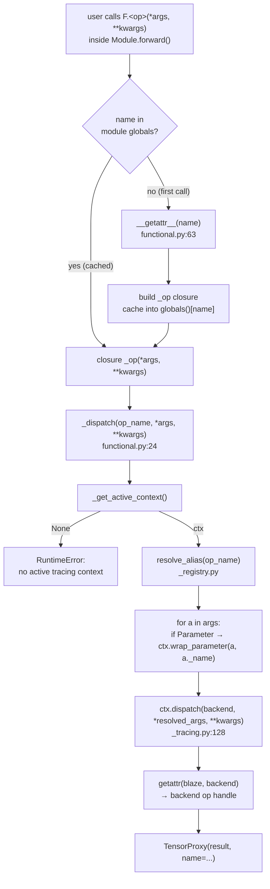

# Functional dispatch — `_dispatch` and the lazy `__getattr__`

`blaze_nn.functional` (conventionally imported as `F`) is the user-facing op surface. It looks like `torch.nn.functional`: users call `F.matmul(x, w)`, `F.rmsnorm(x, gamma, epsilon=1e-5)`, `F.linear(x, w)` from inside `Module.forward()`. The file is short (~98 lines) and does exactly three things — a shared `_dispatch` helper, two explicit shims, and a module-level `__getattr__` that lazily synthesizes a closure for every other op.

This page walks the file top to bottom and pins each behavior to the tests that lock it in.

## End-to-end resolution path

The diagram below traces a single `F.<op>(*args, **kwargs)` call from user code down to the backend op handle. The first-call path runs through `__getattr__`; subsequent calls hit the cached closure in module globals and skip it.



The shape of this path matters for two reasons. First, `_dispatch` is the only place that wraps a `Parameter` argument — every other arg passes through verbatim, and the active context is responsible for unwrapping `TensorProxy._inner` later (see `_unwrap_args` at `blaze_nn/_tracing.py:70`). Second, alias resolution happens **here**, before `ctx.dispatch` ever sees the name — by the time `ctx.dispatch` looks up `getattr(blaze, op_name)` (`blaze_nn/_tracing.py:131`) it already has the backend name.

## Walking `_dispatch` (`functional.py:24`)

```python
def _dispatch(op_name: str, *args: Any, **kwargs: Any) -> TensorProxy:
    from ._tracing import _get_active_context
    ctx = _get_active_context()
    if ctx is None:
        raise RuntimeError(
            f"blaze_nn.F.{op_name}() must be called inside a Module.forward(). "
            "There is no active tracing context."
        )
    backend = resolve_alias(op_name)
    resolved_args = []
    for a in args:
        if isinstance(a, Parameter):
            resolved_args.append(ctx.wrap_parameter(a, a._name))
        else:
            resolved_args.append(a)
    return ctx.dispatch(backend, *resolved_args, **kwargs)
```

Four observations contributors should know cold:

1. **Lazy import of `_tracing`.** The `from ._tracing import _get_active_context` lives inside the function body, not at module scope. This is intentional: importing `blaze_nn.functional` must remain cheap and must not pull in `blaze` (which `_tracing.py` does at runtime). The tracing context module is loaded only when the first op actually dispatches.
2. **The "no active tracing context" error is the canonical user-facing diagnostic.** Every `F.*` call that escapes a tracing context hits this branch. The string `"no active tracing context"` is asserted verbatim in `tests/test_functional.py:TestFunctionalNoContext` — eight `pytest.raises(RuntimeError, match="no active tracing context")` assertions across `F.linear`, `F.rmsnorm`, `F.mcast`, `F.gather`, `F.gated_reduce`, `F.residual_add`, `F.rope`, `F.sliced_matmul`. Do not change that substring.
3. **Alias resolution happens before parameter wrapping.** `resolve_alias("linear")` returns `"matmul"`; `resolve_alias("rmsnorm")` returns `"rmsnorm"` (pass-through). The full `_registry.py` semantics are in [`registry.md`](registry.md).
4. **Only `Parameter` instances are wrapped.** `TensorProxy` args, ints, floats, strings, and `ttnn.Tensor` device handles all pass through verbatim. The active context's `_unwrap_args` (`_tracing.py:70`) handles `TensorProxy` unwrapping at dispatch time.

> **Note:** Users never call `_dispatch` directly; they always go through `F.<op>(...)` or one of the explicit shims. The function is module-private by convention — it is not listed in `__dir__`'s static names and would not appear in tab-completion suggestions.

## The two explicit shims

Most ops need no entry in `functional.py` at all. Two exist because they need argument handling that the universal closure does not provide.

### `linear` — rejects `bias` explicitly

```python
def linear(input: TensorProxy, weight: Any, *, bias: Any = None, **kwargs: Any) -> TensorProxy:
    if bias is not None:
        raise NotImplementedError(
            "F.linear with bias not yet supported; use F.residual_add separately"
        )
    return _dispatch("linear", input, weight, **kwargs)
```

The signature mirrors `torch.nn.functional.linear(input, weight, bias=None)`, but bias is not yet supported on the hardware path. The shim raises `NotImplementedError` with an actionable suggestion ("use `F.residual_add` separately"). Note that the op name passed to `_dispatch` is `"linear"` — the alias to `"matmul"` is resolved inside `_dispatch` by `resolve_alias`. The shim does not pre-resolve. The behavior is pinned by `tests/test_functional.py:TestLinearBiasNotSupported::test_linear_with_bias_raises`.

### `sliced_matmul` — defaults `branch="gate"`

```python
def sliced_matmul(input: TensorProxy, weight: Any, *, branch: str = "gate", **kwargs: Any) -> TensorProxy:
    return _dispatch("sliced_matmul", input, weight, branch=branch, **kwargs)
```

This one is a friendlier-name + kwarg-default convenience. The underlying tt-blaze op (`kn_sliced_matmul`, set in `_registry.py`) requires a `branch` kwarg to disambiguate gate-vs-up projections in gated-MLP layouts. Forgetting it would emit a confusing kwarg error from deep in the backend; the shim sets the conventional default at the blaze-nn boundary. The dispatch-integration test `tests/test_dispatch_integration.py:test_sliced_matmul_alias_creates_kn_sliced_matmul_node` confirms that `F.sliced_matmul(x, w, branch="up")` produces a `kn_sliced_matmul` node with `kwargs={"branch": "up"}`.

> **Rule of thumb.** Add an explicit shim only when (a) you need to reject or pre-validate an arg that the universal closure would silently forward, or (b) you want a friendlier name **and** a non-default kwarg. Alias-only cases belong in `_registry.py`, not here.

## Walking `__getattr__` (`functional.py:63`)

```python
def __getattr__(name: str) -> Callable[..., TensorProxy]:
    if name.startswith("_"):
        raise AttributeError(name)
    def _op(*args: Any, **kwargs: Any) -> TensorProxy:
        return _dispatch(name, *args, **kwargs)
    _op.__name__ = name
    _op.__qualname__ = f"functional.{name}"
    _op.__doc__ = (
        f"Dispatch to the tt-blaze ``{resolve_alias(name)}`` op via the "
        "active tracing context. See the tt-blaze op's emit() for kwargs."
    )
    globals()[name] = _op
    return _op
```

Three details worth pinning:

1. **Underscore re-raise.** `name.startswith("_")` short-circuits to `AttributeError(name)` so that private/dunder attribute lookups behave normally. Without this, `hasattr(F, "__wrapped__")` would manufacture a phantom dispatcher and break introspection. Locked in by `tests/test_functional.py:TestDynamicDispatch::test_underscore_names_still_attribute_error`.
2. **No existence check at lookup time.** The closure is built unconditionally — the op's existence is checked only when the closure is **called** inside a tracing context (`ctx.dispatch` raises `ValueError("Unknown blaze op")` if `getattr(blaze, op_name)` returns `None`, see `blaze_nn/_tracing.py:131`). This is the right trade: `getattr(F, "any_future_op_name")` should not need a tt-blaze install just to succeed at introspection time, and the parametrized test `test_unknown_op_returns_callable_and_routes_through_dispatch` enumerates `"embedding"`, `"copy"`, `"scatter"`, `"argmax"`, `"barrier_sender"`, `"untilize"`, `"swiglu"`, `"moe"`, `"any_future_op_name"` all returning a callable without raising.
3. **Caching into module globals.** `globals()[name] = _op` installs the closure on the module so the next `F.<name>` access skips `__getattr__` and hits normal attribute resolution. This matters when an op is called inside a hot loop — a layer-stack forward calling `F.matmul` once per layer pays the `__getattr__` cost exactly once per process, then never again. Closure object identity is stable after first lookup; tests can rely on `F.matmul is F.matmul` after the first call.

## Walking `__dir__` (`functional.py:91`)

```python
def __dir__() -> list[str]:
    static = ["linear", "sliced_matmul"]
    try:
        from blaze.blaze_op import BlazeOp
        return sorted(set(static) | set(BlazeOp._class_registry.keys()))
    except Exception:
        return static
```

`dir(F)` is the discovery surface. The static list names the two explicit shims; the union with `BlazeOp._class_registry.keys()` adds every op tt-blaze has registered at runtime. The bare `except Exception:` is deliberately wide — when tt-blaze is not importable (the framework-only test tier), `dir(F)` must still return something useful rather than blow up. The fallback yields the two explicit names, which is what `tests/test_functional.py:TestDynamicDispatch::test_dir_includes_explicit_aliases` asserts.

> **Warning:** Do not narrow this `except` to `ImportError`. Some `blaze` import failures in CI environments surface as `RuntimeError` or `AttributeError` from C++ binding init; the wide catch is what keeps the framework-only suite green.

## Why two-stage resolution (alias → dispatch)

Note that `_dispatch` calls `resolve_alias(op_name)` *and then* hands off to `ctx.dispatch(backend, ...)`. Both layers consult the registry — for different purposes:

- `_dispatch` runs `resolve_alias` only, translating the public name to the backend name before handing off.
- `ctx.dispatch` (graph mode, `blaze_nn/_tracing.py:128`) then runs `_resolve_grid(op_name, ...)` and `needs_sender_core(op_name)` on the *already-resolved* backend name — both consult "backend op names". This is why the registry's placement flags are deliberately set on backend entries (`matmul`, not `linear`); the next file explains the split.

`tests/test_dispatch_integration.py:test_chained_ops_create_edge` is the smallest end-to-end pin that exercises both: `F.rmsnorm(...)` followed by `F.matmul(...)` produces a two-node graph with an `rmsnorm_1 → matmul_1` edge, demonstrating that the dispatcher hands enough information to the context to wire producers and consumers correctly.

## Anchoring tests

Two test files are the source of truth for everything on this page:

- `tests/test_functional.py` — framework-only (no tt-blaze, no device). Covers: the "no active tracing context" raise for eight named ops; `F.linear(..., bias=...)` `NotImplementedError`; `getattr(F, op_name)` returning a callable for nine arbitrary names; underscore names re-raising `AttributeError`; `dir(F)` containing the explicit aliases; `resolve_alias` mapping.
- `tests/test_dispatch_integration.py` — gated by `pytest.importorskip("blaze")`. Covers: `F.linear` produces a `matmul` node; chained ops produce the right edge; dynamic dispatch for ops not in any allow-list; `F.totally_made_up_op_name(x)` raises `ValueError("Unknown blaze op")`; `F.sliced_matmul(x, w, branch="up")` produces a `kn_sliced_matmul` node carrying the kwarg.

Together these two files give you a complete behavioral spec for the dispatch surface without ever booting a device.

---

_Previous: [Chapter 5 — Tracing internals: from `Module.__call__` to `program.run()`](../ch5_tracing_internals/tensor_proxy.md) · Next: [The op registry — aliases and placement hints](registry.md) · [Up](index.md)_
