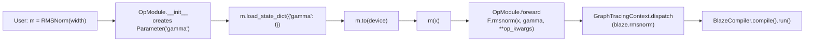

# Adding an op wrapper — the `blaze_nn/ops/<op>/` convention

The most common extension task is wrapping a tt-blaze op that already exists upstream so that model authors get a torch-shaped class with named `Parameter` slots, instead of having to call `F.<op>(input, *params, **kwargs)` by hand every time. The `blaze_nn/ops/` package holds these wrappers — one subpackage per op, mirroring `blaze.ops.*`.

This file walks the canonical pattern (`RMSNorm`) end to end, gives a checklist for new wrappers, draws the boundary between `ops/` and `modules/`, and lists the tests you must add. The interlock with the registry, dispatch, and the `user_allocated_outputs` mechanism is covered in [Chapter 6 — Functional dispatch](../ch6_dispatch_and_registry/functional_dispatch.md) and [Chapter 6 — Caller-allocated outputs internals](../ch6_dispatch_and_registry/caller_allocated_outputs_internals.md).

## The package itself

`blaze_nn/ops/__init__.py` is a docstring-only file. It declares the convention:

> "Microp wrappers — one subpackage per tt-blaze op, mirroring `blaze.ops`. Each subpackage exposes a single class with a `torch.nn`-style constructor signature (e.g. `RMSNorm(normalized_shape, eps=...)`). Parameters are declared as empty `Parameter` slots; users populate them with pre-placed `ttnn.Tensor` values via `load_state_dict` or the `init_torch_params` convenience helper."

There is no auto-discovery and no registration table on the `blaze_nn` side — each op is its own subpackage with an `__init__.py` that exports the class:

```python
# blaze_nn/ops/rmsnorm/__init__.py
from .op import RMSNorm

__all__ = ["RMSNorm"]
```

Users import from the subpackage:

```python
from blaze_nn.ops.rmsnorm import RMSNorm
```

## The canonical small example

`blaze_nn/ops/rmsnorm/op.py:8-29` is the canonical wrapper and exercises every part of the convention:

```python
class RMSNorm(OpModule):
    op = "rmsnorm"
    params = ("gamma",)

    def __init__(self, normalized_shape: int, eps: float = 1e-6) -> None:
        super().__init__(epsilon=eps, width=normalized_shape)
        self.normalized_shape = normalized_shape
        self.eps = eps

    def _torch_init_specs(self):
        return [("gamma", (1, self.normalized_shape), [1, 32])]
```

Five things are happening:

1. **Class attribute `op`** — names the tt-blaze op the default `OpModule.forward` will dispatch through. `"rmsnorm"` is in `BlazeOp._class_registry`, so this just works; no `define_fused_op` override is needed.
2. **Class attribute `params`** — declares one `Parameter` slot, `gamma`. `OpModule.__init__` walks this tuple and creates `self.gamma = Parameter()` for each name (see `blaze_nn/modules/base.py:364-365`).
3. **Torch-shaped constructor** — `RMSNorm(normalized_shape, eps=1e-6)` mirrors `torch.nn.RMSNorm` exactly. Model authors should be able to copy a torch model definition and only rename the import.
4. **Op kwargs passed through `super().__init__(**op_kwargs)`** — `epsilon` and `width` are recorded on `self._op_kwargs` and merged into the `F.rmsnorm` call at forward time (see `blaze_nn/modules/base.py:440-441`). Construction-time kwargs are overridable per call.
5. **`_torch_init_specs` override** — opts into `init_torch_params` for unit tests and demos that want a fresh random `gamma`. The tuple is `(param_name, torch_shape, default_tile_dims)`. Skip this if your op should only ever be populated via `load_state_dict`.

## Checklist for a new wrapper

```text
blaze_nn/ops/<my_op>/
  __init__.py    # from .op import MyOp; __all__ = ["MyOp"]
  op.py          # class MyOp(OpModule): ...
```

In `op.py`:

1. **Subclass `OpModule`** — `from ...modules.base import OpModule`. Never subclass `Module` directly when there is a 1:1 mapping to a tt-blaze op; you would re-derive what `OpModule.forward` already does.
2. **Set the class attribute `op`** to the exact name registered in `BlazeOp._class_registry` (or the alias name you added to `_REGISTRY`).
3. **Set the class attribute `params`** to a tuple of slot names in declaration order. The default `forward` passes them positionally after the activation: `F.<op>(x, *params, **kwargs)`.
4. **Mirror the torch constructor signature.** Match argument order, names, and defaults. If your torch counterpart accepts `bias=True`, decide whether to honor it (route through `F.residual_add`) or raise `NotImplementedError` the way `Linear` does (`blaze_nn/modules/linear.py:67-70`).
5. **Forward op-init kwargs via `super().__init__(**op_kwargs)`.** These flow to the op as kwargs at call time and are overridable.
6. **Override `_torch_init_specs`** if you want `init_torch_params` to work. Default is `[]`, which makes `init_torch_params` a no-op — the auto-init branch at `blaze_nn/modules/base.py:427-428` only triggers when specs are non-empty.
7. **Override `define_fused_op`** only when the op does not exist upstream — see [Adding a fused op](add_a_fused_op.md). For ops already in tt-blaze, the base default (a no-op) is correct.
8. **Override `forward`** only when the default `F.<op>(input, *params, **kwargs)` shape does not match the upstream op's call signature. This is uncommon; if you need it, do not call `F.*` for plumbing — use it only to dispatch the actual op, and keep the rest of `forward` torch-free.

> **Warning:** If you set `op` to a name that is **not** registered in `BlazeOp._class_registry`, the wrapper will construct fine *unless you also override `define_fused_op`* (see [Adding a fused op](add_a_fused_op.md)) — for the pure-`ops/` wrapper pattern described in this file (no `define_fused_op` override) the op is not consulted at `__init__` except via `_lookup_user_allocated_outputs`, which returns `()` for unknown ops (see `blaze_nn/modules/base.py:269-285`). But the first `forward()` call will fail inside `GraphTracingContext.dispatch` with `ValueError("Unknown blaze op")`. If your wrapper points at an op that does not yet exist upstream, override `define_fused_op` to synthesize it (see [Adding a fused op](add_a_fused_op.md)); note that `define_fused_op` runs at `__init__` time (`blaze_nn/modules/base.py:345-349`), *before* the `_lookup_user_allocated_outputs` call, so a synthesis failure surfaces at construction — not at first forward. Otherwise pick a name that already exists.

## `ops/` versus `modules/`

The two directories look similar but have distinct purposes:

| Aspect | `blaze_nn/ops/<op>/` | `blaze_nn/modules/` |
|---|---|---|
| **Cardinality** | One tt-blaze op per subpackage | Multi-op fused modules |
| **Example** | `RMSNorm` → `F.rmsnorm` | `Linear` → mcast → matmul → gather |
| **`define_fused_op`** | Almost never needed | Often needed (see `linear.py`) |
| **Caller-allocated outputs** | Only if upstream op declares them | Common (`Linear` declares `"output"`) |
| **Constructor shape** | Mirrors `torch.nn.<X>` | Mirrors `torch.nn.<X>` |

Rule of thumb: if `define_fused_op` is non-trivial, the wrapper belongs in `blaze_nn/modules/` next to `linear.py`. If the wrapper is a thin subclass that only sets `op` and `params`, it belongs in `blaze_nn/ops/<op>/`.

## What you do NOT need to touch

For most new wrappers, the registry and the dispatch layer require zero changes:

- **`blaze_nn/_registry.py`** — only touch this if you need a friendlier name (alias), placement on the matmul subgrid (`uses_matmul_cores`), or auto-injection of the device sender core (`needs_sender_core`). Decision tree in [Chapter 6 — Registry](../ch6_dispatch_and_registry/registry.md).
- **`blaze_nn/functional.py`** — only touch this if you need a non-trivial argument shim (the existing `linear` and `sliced_matmul` shims are the bar). The lazy `__getattr__` already routes any op name to a working dispatch closure (see `blaze_nn/functional.py:63`).

If your wrapper does not need either, you are done.

## Where the wrapper sits in the call chain



The whole point of the convention is that boxes B, F, G, and H are framework code you do not write per op — your subclass is just box A and the class body.

## Tests to add

The three-tier rule (see [Testing strategy](testing_strategy.md)) translates directly to op wrappers:

1. **Framework-only test** — Add a `TestMyOp` class in `tests/test_op_module.py` that constructs the class, asserts the `_param_slots` and `_op_kwargs` are populated, exercises `load_state_dict` with an `object()` sentinel, and asserts `state_dict()` returns the same identity. No tt-blaze, no device.
2. **Dispatch-integration test** — Add a case in `tests/test_dispatch_integration.py` (gated by `pytest.importorskip("blaze")`) that opens a `GraphTracingContext`, runs your wrapper's `forward`, and asserts a node with the expected `spec.name` appears in `ctx.graph.nodes`. Mirror the existing `test_linear_alias_creates_matmul_node` shape (see `tests/test_dispatch_integration.py:25`).
3. **Parity test (optional, device-gated)** — If a torch reference makes sense, add a case in `tests/test_pytorch_parity.py` that builds a `ttnn.Tensor` input, runs the wrapper, pulls the result via `ttnn.to_torch`, and compares against a `torch_reference.*_ref` golden using `comp_pcc(..., pcc=0.99)`.

> **Note:** Steps 1 and 2 are non-negotiable. Step 3 depends on whether a torch reference exists and whether the contributor has a Tenstorrent device locally.

---

_Previous: [Chapter 6 — Op dispatch, the registry, and caller-allocated outputs](../ch6_dispatch_and_registry/caller_allocated_outputs_internals.md) · Next: [Adding a fused op — when the op does not exist upstream](add_a_fused_op.md) · [Up](index.md)_
