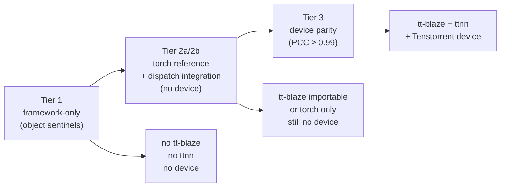

# Testing strategy — the test taxonomy (reverse index)

The blaze-nn test suite is organized into three tiers by how much of the stack each tier requires. This file is the reverse index: it names every test file in the repo, the tier it lives in, and the chapter sections whose claims it backs. A contributor adding a new feature should read this from the top once, then use the per-section back-references to find existing tests to mirror.

[Chapter 1 — Getting started](../ch1_why_blaze_nn/getting_started.md) introduced the three tiers at install time. This file enumerates each file in each tier.

## The three tiers

| Tier | Imports | Sentinel strategy | Gate |
|---|---|---|---|
| 1 — framework-only | `blaze_nn` only | `object()` instances stand in for `ttnn.Tensor` | none |
| 2a — torch reference | `torch` only | real `torch.Tensor`s; pure-python `*_ref` goldens | `import torch` (assumed available) |
| 2b — dispatch integration | `blaze_nn` + `blaze` | builds a real `BlazeGraph` via `blaze.fuse()`; no device | `pytest.importorskip("blaze")` |
| 3 — device parity | `blaze_nn` + `blaze` + `ttnn` | real `ttnn.Tensor`s; `comp_pcc(..., pcc=0.99)` against a torch golden | `pytest.importorskip("blaze")`, `pytest.importorskip("ttnn")`, and a non-zero `ttnn.get_num_devices()` |

## Tier 1 — framework-only

These files import only `blaze_nn` and `pytest`. They use `object()` instances as opaque parameter values, exercising the framework's "treat values as opaque" contract end to end. They run anywhere Python runs.

| File | What it covers | Backs |
|---|---|---|
| `tests/test_parameter.py` | `Parameter()` slot semantics, `data` property roundtrip, `__repr__` heuristics, `_name` autopopulation by `Module.__setattr__` | [Ch2 `parameter.md`](../ch2_module_and_parameter/parameter.md) |
| `tests/test_module.py` | `__setattr__` / `__getattr__` / `__delattr__` routing, `parameters` / `named_parameters` / `modules` / `named_modules` traversal, `forward` abstract contract, `to(device)` recursion | [Ch2 `module_attribute_protocol.md`](../ch2_module_and_parameter/module_attribute_protocol.md), [Ch2 `traversal_and_state_dict.md`](../ch2_module_and_parameter/traversal_and_state_dict.md), [Ch2 `device_binding.md`](../ch2_module_and_parameter/device_binding.md) |
| `tests/test_containers.py` | `Sequential`, `ModuleList`, `ModuleDict` iteration / indexing / append; `_NotCallableContainer` error messages | [Ch3 `sequential.md`](../ch3_containers_and_opmodule/sequential.md), [Ch3 `modulelist_and_moduledict.md`](../ch3_containers_and_opmodule/modulelist_and_moduledict.md) |
| `tests/test_state_dict.py` | identity-preserving roundtrips, strict-key behavior, dotted-key descent through `ModuleList` | [Ch2 `traversal_and_state_dict.md`](../ch2_module_and_parameter/traversal_and_state_dict.md) |
| `tests/test_op_module.py` | both `OpModule` forms (no-subclass via `op=`/`params=` and subclass via class attrs), `_param_slots`, `_op_kwargs`, `state_dict` roundtrip with sentinels | [Ch3 `opmodule_no_subclass.md`](../ch3_containers_and_opmodule/opmodule_no_subclass.md), [Ch3 `opmodule_subclass.md`](../ch3_containers_and_opmodule/opmodule_subclass.md) |
| `tests/test_functional.py` | `F.*` raises `RuntimeError` outside an active context; module-level `__getattr__` caches the closure into `globals()`; alias resolution via `resolve_alias` | [Ch6 `functional_dispatch.md`](../ch6_dispatch_and_registry/functional_dispatch.md), [Ch6 `registry.md`](../ch6_dispatch_and_registry/registry.md) |

Total: six files, ~660 lines. None of them imports `torch`, `blaze`, or `ttnn`.

## Tier 2a — torch reference sanity

| File | What it covers | Backs |
|---|---|---|
| `tests/test_integration.py` | Sanity-checks the pure-torch `*_ref` helpers in `tests/torch_reference.py` (`linear_ref`, `rmsnorm_ref`, `silu_ref`, `gated_reduce_ref`, `residual_add_ref`, `eltwise_mul_ref`) and the `comp_pcc(..., pcc=0.99)` utility | [Ch1 `getting_started.md`](../ch1_why_blaze_nn/getting_started.md) (test-tier introduction); golden-comparison plumbing reused by Tier 3 |

This tier exists so contributors can verify their reference torch implementation is correct *before* spending device time on parity tests. The goldens here are reused by `test_pytorch_parity.py` and by `examples/qwen3_embedding_0_6b/tests/test_layer_parity.py` / `test_e2e_parity.py`. The file's own docstring is unambiguous: "pure PyTorch, no hardware."

## Tier 2b — dispatch integration

| File | What it covers | Backs |
|---|---|---|
| `tests/test_dispatch_integration.py` | Real `BlazeGraph` construction via `blaze.fuse()`; node names match aliases (`linear → matmul`, `sliced_matmul → kn_sliced_matmul`); universal `__getattr__` dispatches op names not in any allow-list (e.g. `F.untilize`, `F.copy`); `F.totally_made_up_op_name` raises `ValueError("Unknown blaze op")`; `OpModule` kwargs flow through to node kwargs | [Ch5 `tracing_contexts.md`](../ch5_tracing_internals/tracing_contexts.md), [Ch6 `functional_dispatch.md`](../ch6_dispatch_and_registry/functional_dispatch.md), [Ch6 `registry.md`](../ch6_dispatch_and_registry/registry.md) |

This file is gated by `pytest.importorskip("blaze")` at the top. It is the cheapest way to verify a new op or alias reaches the graph correctly — no device required, sub-second to run.

## Tier 3 — device parity

| File | What it covers | Backs |
|---|---|---|
| `tests/test_pytorch_parity.py` | End-to-end pipelines: `Linear` (`set_output_tensor` → `load_state_dict` → `to(device)` → forward → `comp_pcc(..., pcc=0.99)` against `linear_ref`), `RMSNorm` (same shape, different memory configs by width) | [Ch3 `prebuilt_modules.md`](../ch3_containers_and_opmodule/prebuilt_modules.md), [Ch6 `caller_allocated_outputs_internals.md`](../ch6_dispatch_and_registry/caller_allocated_outputs_internals.md) |

Gated by three checks at the top: `pytest.importorskip("blaze")`, `pytest.importorskip("ttnn")`, and `if ttnn.get_num_devices() == 0: pytest.skip(...)` in the `mesh_device` fixture. PCC threshold is `0.99` everywhere at this single-op level; assertion messages always quote the actual PCC achieved.

## qwen3 test slices

The qwen3 example carries its own pytest tree under `examples/qwen3_embedding_0_6b/tests/` with the `l0` / `l1` taxonomy. The split mirrors the three-tier model but with a qwen3-specific slice axis:

| Files | Tier | What it covers | Backs |
|---|---|---|---|
| `tests/test_l0_config.py` | 1 (no torch) | `Qwen3EmbeddingConfig` defaults match HF (`dim=1024`, `n_layers=28`, etc.) and derived properties | [Ch4 `layout_and_weight_loader.md`](../ch4_qwen3_walkthrough/layout_and_weight_loader.md) |
| `tests/test_l0_keys.py` | 2a (torch only) | `_hf_to_blaze_torch_tensors` + `expected_state_dict_keys` produce the exact blaze_nn key set; HF → blaze key remap is correct | [Ch4 `layout_and_weight_loader.md`](../ch4_qwen3_walkthrough/layout_and_weight_loader.md) |
| `tests/test_l0_rope.py` | 2a (torch only) | `_precompute_rope_tables` math: `cos² + sin² = 1`, table shapes, `trans_mat` orthogonality | [Ch4 `composing_submodules.md`](../ch4_qwen3_walkthrough/composing_submodules.md) RoPE section |
| `tests/test_l1_kv_cache.py` | 3 (device) | `update_cache_for_token_` bridge between sharded SDPA output and interleaved KV layout | [Ch4 `buffers_and_address_baking.md`](../ch4_qwen3_walkthrough/buffers_and_address_baking.md) |
| `tests/test_l1_qkv_heads.py` | 3 | `nlp_create_qkv_heads_decode` host hop + bridges in `Qwen3Attention` | [Ch4 `buffers_and_address_baking.md`](../ch4_qwen3_walkthrough/buffers_and_address_baking.md) |
| `tests/test_l1_rmsnorm.py` | 3 | `blaze_nn.ops.RMSNorm` parity at qwen3 widths (`dim=1024`, `head_dim=128`) — PCC 0.99 | [Ch3 `prebuilt_modules.md`](../ch3_containers_and_opmodule/prebuilt_modules.md), [Ch4 `composing_submodules.md`](../ch4_qwen3_walkthrough/composing_submodules.md) |
| `tests/test_l1_rope.py` | 3 | `RoPE` `OpModule` parity; buffer-address kwarg path | [Ch4 `composing_submodules.md`](../ch4_qwen3_walkthrough/composing_submodules.md), [Ch4 `tensor_lifetimes.md`](../ch4_qwen3_walkthrough/tensor_lifetimes.md) |
| `tests/test_l1_sdpa.py` | 2b (no device for the assertion under test) | `_register_sdpa_decode_user_alloc` idempotent monkey-patch of `SDPADecode.user_allocated_outputs` | [Ch4 `buffers_and_address_baking.md`](../ch4_qwen3_walkthrough/buffers_and_address_baking.md), [Ch6 `caller_allocated_outputs_internals.md`](../ch6_dispatch_and_registry/caller_allocated_outputs_internals.md) |
| `tests/test_l1_token_embed.py` | 3 | `TokenEmbedding` reads `weight.buffer_address()` and routes via `weight_buffer_address` kwarg | [Ch4 `composing_submodules.md`](../ch4_qwen3_walkthrough/composing_submodules.md), [Ch4 `tensor_lifetimes.md`](../ch4_qwen3_walkthrough/tensor_lifetimes.md) |
| `tests/test_layer_parity.py` | 3 | A full `Qwen3DecoderLayer` against a torch reference layer; the orchestrator pattern in practice — PCC 0.95 for attention, 0.93 for the decoder layer | [Ch4 `orchestrator_pattern.md`](../ch4_qwen3_walkthrough/orchestrator_pattern.md), [Ch4 `composing_submodules.md`](../ch4_qwen3_walkthrough/composing_submodules.md) |
| `tests/test_e2e_parity.py` | 3 | Full `Qwen3EmbeddingModel` end-to-end decode-shaped forward; PCC 0.95 against HF Qwen3 reference | [Ch4 `orchestrator_pattern.md`](../ch4_qwen3_walkthrough/orchestrator_pattern.md), [Ch4 `buffers_and_address_baking.md`](../ch4_qwen3_walkthrough/buffers_and_address_baking.md) |

### Why the PCC thresholds descend (0.99 → 0.95 → 0.93)

The descending thresholds are not arbitrary — they encode how many bf16 ops fit between the torch reference and the calculated tensor:

- **0.99** at the single-op level (`test_pytorch_parity.py`, `test_l1_rmsnorm.py`, `test_l1_rope.py`): one op, one rounding boundary.
- **0.95** at the block / model level (attention in `test_layer_parity.py`, the full `Qwen3EmbeddingModel` in `test_e2e_parity.py`): tens to hundreds of bf16 ops accumulate before the comparison.
- **0.93** at the full decoder-layer level (`test_layer_parity.py`): norm + attention + norm + MLP + two residual adds, all bf16, all stacked.

When adding a new parity test, pick the threshold that matches your op chain length and document it in the assertion message as the existing tests do (`PCC={pcc:.6f} (target 0.99)`). Lower thresholds need a written justification in the PR description.

## Recipe — what tests to add for a new feature

The standard ladder for any new framework feature is:

1. **Tier 1 first.** Write framework-only tests using `object()` sentinels for any new state on `Module` / `Parameter` / containers / `OpModule`. These are the cheapest, fastest tests in the repo and they fail loudly when contract changes break invariants. Mirror the shape of `tests/test_op_module.py` or `tests/test_module.py`.
2. **Tier 2b next.** If your feature touches dispatch, the registry, tracing contexts, or `define_fused_op`, add a case to `tests/test_dispatch_integration.py`. Open a `GraphTracingContext(device_config=None)`, run your code, and assert `ctx.graph.nodes` / `ctx.graph.edges` are what you expect.
3. **Tier 3 last.** If your feature changes numerical behavior, add a parity test in `tests/test_pytorch_parity.py` (or the qwen3 `test_l1_*.py` if it is a qwen3 module). Use `comp_pcc(..., pcc=0.99)` at single-op level; lower thresholds need a written justification.

Reverse rule: do not skip tiers. A device parity test that fails has too many candidate root causes — a contributor with a passing Tier 1 + Tier 2b but a failing Tier 3 has narrowed the bug to one of: numerics, memory config, sharding, or hardware. A contributor with only a Tier 3 test is debugging blind.

## Known gap

**Compose mode has no end-to-end test.** A grep across the test suite for `compose` returns no test cases that open a `ComposeTracingContext` or invoke `@blaze_nn.compose`. Every existing test exercises the graph path. The contract walked in [Chapter 5 — Tracing contexts](../ch5_tracing_internals/tracing_contexts.md) — that `_call_compose` constructs a `FusedProgram(kernel=None, device=...)`, wraps inputs, runs `forward`, and returns `ctx._fused_program.run()` — is therefore unverified outside hand testing.

> **For new contributors:** if you take on a feature that lives on the compose path (a pre-fused program, a new compose-mode backend, a fix to `ComposeTracingContext.dispatch`), please add a compose-mode dispatch-integration test as part of the PR. The minimum shape is in [Adding a fused op](add_a_fused_op.md). Document the new test in this file's tier table so the gap closes incrementally.

---

_Previous: [Extending containers and modules — beyond the built-ins](extending_containers_and_modules.md) · Next: [Contributing checklist — concrete recipes and anti-patterns](contributing_checklist.md) · [Up](index.md)_
